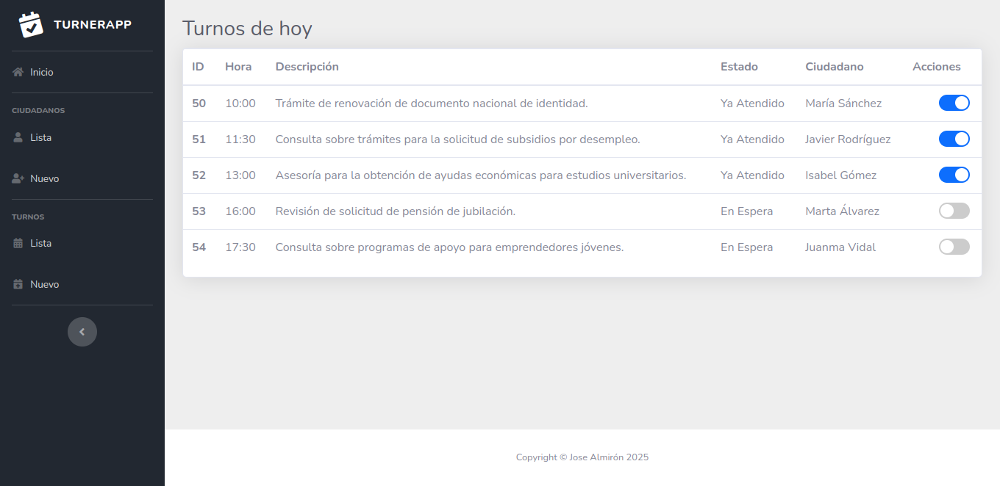
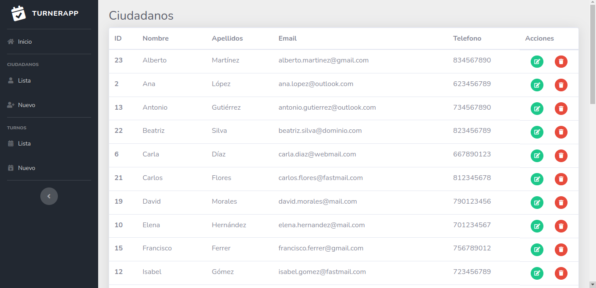
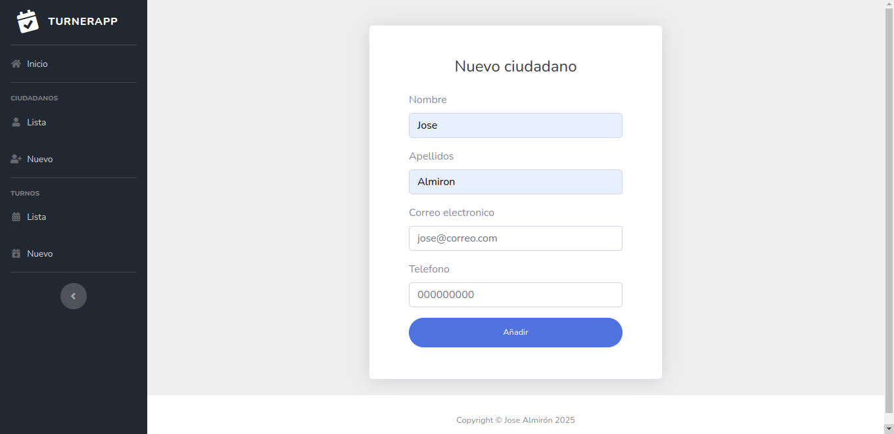
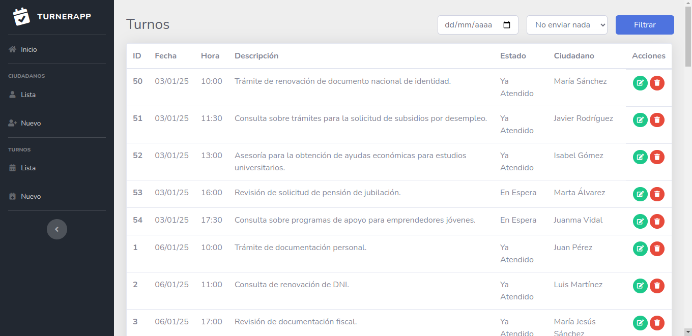
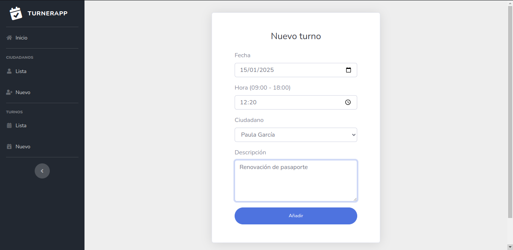

# Prueba técnica 2 - Sistema de turnos
La aplicación es un panel de control para gestionar turnos relacionados con trámites gubernamentales. Incluye un módulo para ciudadanos y sus respectivos turnos. Cada sección del panel se explicará en detalle más adelante. 

## **Tabla de Contenidos**
- [Instalación](#instalación)
- [Características](#características)
- [Tecnologías Usadas](#tecnologías-usadas)

## **Instalación**
Sigue estos pasos para instalar y configurar el proyecto en tu entorno local:  

1. Clona este repositorio:
```bash
git clone https://github.com/jose-016al/AlmironJose_pruebatec2.git
```

2. Asegúrate de que tienes un servidor MySQL en funcionamiento y crea una base de datos llamada `turnerApp` para que la aplicación pueda generar las tablas correspondientes:
```bash
CREATE DATABASE turnerApp
```

3.Configura el archivo `persistence.xml`:  
Localiza el archivo `persistence.xml` en la ruta `src/main/resources/META-INF` y actualiza las credenciales de acceso a tu SGBD, así como la URL de conexión, según tu entorno. Aquí tienes un ejemplo del archivo con los campos que puedes modificar:
```xml
<?xml version="1.0" encoding="UTF-8"?>
<persistence version="2.2" xmlns="http://xmlns.jcp.org/xml/ns/persistence" xmlns:xsi="http://www.w3.org/2001/XMLSchema-instance" xsi:schemaLocation="http://xmlns.jcp.org/xml/ns/persistence http://xmlns.jcp.org/xml/ns/persistence/persistence_2_2.xsd">
   <persistence-unit name="TurnerPU" transaction-type="RESOURCE_LOCAL">
    <provider>org.eclipse.persistence.jpa.PersistenceProvider</provider>
    <class>com.josealmiron.logica.Citizen</class>
    <class>com.josealmiron.logica.Appointment</class>
    <exclude-unlisted-classes>false</exclude-unlisted-classes>
    <properties>
      <property name="javax.persistence.jdbc.url" value="jdbc:mysql://localhost:3306/turnerApp?serverTimezone=UTC"/>
      <property name="javax.persistence.jdbc.user" value="user"/>
      <property name="javax.persistence.jdbc.driver" value="com.mysql.cj.jdbc.Driver"/>
      <property name="javax.persistence.jdbc.password" value="user"/>
      <property name="javax.persistence.schema-generation.database.action" value="create"/>
    </properties>
  </persistence-unit>
</persistence>
```
- `javax.persistence.jdbc.url`: Cambia `localhost` y `3306` si tu servidor MySQL está en una dirección diferente o usa otro puerto.
- `javax.persistence.jdbc.user`: Introduce el nombre de usuario de tu base de datos.
- `javax.persistence.jdbc.password`: Introduce la contraseña del usuario.

4. Configura el servidor web:  

El proyecto está diseñado para ejecutarse en Apache Tomcat y desarrollado en NetBeans. Para conectar la aplicación con el servidor:  

- Asegúrate de que Tomcat está instalado y configurado en tu sistema.
- Abre el proyecto en NetBeans.
- Al ejecutar el proyecto, NetBeans te guiará paso a paso para configurar la conexión con el servidor Tomcat.

5. Ejecuta la aplicación:  

Una vez completados los pasos anteriores, ejecuta el proyecto desde NetBeans y accede a la aplicación a través de tu navegador en la URL proporcionada por el servidor.

## Características
Esta aplicación de gestión de turnos permite realizar las siguientes acciones:  

- Gestión de Ciudadanos:
  - Crear nuevos ciudadanos.
  - Editar la información de ciudadanos existentes.
  - Eliminar ciudadanos registrados.
- Gestión de Turnos:
  - Crear turnos asociados a ciudadanos previamente registrados.
  - Editar la información de turnos existentes.
  - Eliminar turnos registrados.
- Filtrado de Turnos:
  - Filtrar turnos por fecha.
  - Filtrar turnos por estado ("En Espera", "Ya Atendido").

Estas funcionalidades ofrecen una forma sencilla y eficiente de administrar turnos y ciudadanos en el sistema, adaptándose a diferentes necesidades organizativas.

## Tecnologías Usadas
El proyecto utiliza las siguientes tecnologías y herramientas:
- Frontend:
  - JSP (JavaServer Pages): Para la creación de vistas dinámicas del lado del servidor.
- Backend:
  - Java Persistence API (JPA): Para la gestión de datos y operaciones con la base de datos.
  - Apache Tomcat: Servidor de aplicaciones utilizado para desplegar la aplicación.
- Base de Datos:
  - MySQL: Sistema de gestión de bases de datos relacional.
- IDE:
  - NetBeans: Entorno de desarrollo integrado utilizado para la programación y despliegue del proyecto.

## Uso
La aplicación tiene varias páginas principales, cada una diseñada para cubrir diferentes funcionalidades. A continuación, se describe cada una:  

### Inicio
En esta sección se realiza una llamada a todos los turnos y se filtran según la fecha actual, mostrando únicamente los turnos correspondientes al día de hoy, ordenados por hora. Además, el panel principal permite cambiar el estado de un turno de manera sencilla mediante un interruptor. Este switch, que se acciona dinámicamente, facilita el cambio de estado entre `En Espera` y `Ya Atendido`, o viceversa, según sea necesario. El interruptor aparecerá desactivado cuando el turno esté `En Espera` y se activará automáticamente al marcar el turno como `Ya Atendido`.

### Ciudadanos
Esta sección muestra todos los ciudadanos disponibles, ordenados alfabéticamente. El panel incluye opciones para editar y eliminar ciudadanos. Al eliminar un ciudadano, también se eliminarán automáticamente todos los turnos relacionados con él, evitando inconsistencias en los datos. Por otro lado, la opción de edición redirige a un formulario similar al de alta, que muestra la información existente del ciudadano y permite actualizar ciertos valores. Tras realizar cualquiera de estas acciones, el sistema redirigirá de vuelta al panel de ciudadanos, donde se reflejarán los cambios de forma dinámica y actualizada.

### Nuevo ciudadano
Esta sección es fundamental, ya que permite añadir nuevos turnos, lo cual no sería posible sin ciudadanos registrados. Aquí se encuentra un formulario de alta sencillo que solicita los datos del ciudadano: nombre, apellidos, correo electrónico y teléfono. Los dos últimos campos son opcionales, mientras que los campos de nombre y apellidos son obligatorios. El formulario incluye validaciones para evitar errores, como introducir números en campos de texto. Estas mismas validaciones se aplican al formulario de edición de ciudadanos mencionado previamente. Una vez completado el alta, el sistema redirige automáticamente al panel de ciudadanos, donde se podrán visualizar los cambios de manera inmediata.

### Turnos
Esta sección presenta un panel con todos los turnos, ordenados por fecha. Incluye opciones para editar y eliminar turnos, similares a las del apartado de ciudadanos. Además, dispone de un sistema de filtrado por fecha para facilitar la navegación, ya que, aunque los turnos están ordenados cronológicamente, manejar una gran cantidad de datos o buscar una fecha específica podría ser complicado.

El filtro consiste en un formulario sencillo que permite seleccionar una fecha y, opcionalmente, filtrar los turnos según su estado: `En Espera` o `Ya Atendidos`. Cabe destacar que el filtrado por estado depende de la selección de una fecha, ya que este campo es obligatorio.

Si se desea recuperar la vista original con todos los turnos, basta con hacer clic nuevamente en el enlace de `Turnos`del sidebar, lo que recargará la lista sin aplicar ningún filtro.

### Nuevo Turno
Esta sección presenta un formulario para dar de alta un turno. Los campos disponibles son: fecha, hora, ciudadano y descripción. Mientras que el campo de descripción es opcional, los demás son obligatorios.

El formulario no requiere validaciones adicionales, ya que los campos están configurados para minimizar errores: la fecha y la hora se seleccionan mediante controles que impiden valores inválidos, y el ciudadano se elige de un desplegable con las opciones disponibles.

Como medida adicional, la fecha no puede ser anterior a la actual, ya que no tendría sentido programar turnos en el pasado. Aunque podría haberse implementado un límite máximo para evitar fechas excesivamente futuras, esto no se incluyó debido a la ausencia de requisitos específicos al respecto.

Por otro lado, la hora está restringida a un rango entre las 09:00 y las 18:00, adaptándose a un horario laboral realista. Estas mismas restricciones se aplican en la edición de turnos, con la diferencia de que en esta última se puede modificar el estado del turno. En el alta, todos los turnos se asignan automáticamente al estado `En Espera` por defecto.

## Datos de prueba
Para probar el funcionamiento de la aplicación con datos de ejemplo sin necesidad de ingresarlos manualmente, he preparado un script SQL que inserta datos de prueba. Este recurso puede resultar muy útil para facilitar el proceso de pruebas.
```sql
-- Insertar ciudadanos
INSERT INTO CITIZEN (EMAIL, NAME, PHONE, SURNAME) VALUES
('juan.perez@gmail.com', 'Juan', '612345678', 'Pérez'),
('ana.lopez@outlook.com', 'Ana', '623456789', 'López'),
('pedro.garcia@yahoo.com', 'Pedro', '634567890', 'García'),
('maria.sanchez@dominio.com', 'María', '645678901', 'Sánchez'),
('luis.martinez@correo.com', 'Luis', '656789012', 'Martínez'),
('carla.diaz@webmail.com', 'Carla', '667890123', 'Díaz'),
('javier.rodriguez@fastmail.com', 'Javier', '678901234', 'Rodríguez'),
('lucia.martin@outlook.com', 'Lucía', '689012345', 'Martín'),
('jorge.gonzalez@domain.com', 'Jorge', '690123456', 'González'),
('elena.hernandez@mail.com', 'Elena', '701234567', 'Hernández'),
('sergio.moreno@webmail.com', 'Sergio', '712345678', 'Moreno'), ('isabel.gomez@fastmail.com', 'Isabel', '723456789', 'Gómez'), ('antonio.gutierrez@outlook.com', 'Antonio', '734567890', 'Gutiérrez'), ('laura.ramirez@dominio.com', 'Laura', '745678901', 'Ramírez'), ('francisco.ferrer@gmail.com', 'Francisco', '756789012', 'Ferrer'), ('teresa.castro@correo.com', 'Teresa', '767890123', 'Castro'), ('rafael.perez@domain.com', 'Rafael', '778901234', 'Pérez'), ('marta.alvarez@outlook.com', 'Marta', '789012345', 'Álvarez'), ('david.morales@mail.com', 'David', '790123456', 'Morales'), ('rosa.molina@webmail.com', 'Rosa', '801234567', 'Molina'),
('carlos.flores@fastmail.com', 'Carlos', '812345678', 'Flores'), ('beatriz.silva@dominio.com', 'Beatriz', '823456789', 'Silva'), ('alberto.martinez@gmail.com', 'Alberto', '834567890', 'Martínez'), ('natalia.rios@correo.com', 'Natalia', '845678901', 'Ríos'), ('juanma.vidal@yahoo.com', 'Juanma', '856789012', 'Vidal'), ('paula.garcia@webmail.com', 'Paula', '867890123', 'García'), ('jorge.lopez@domain.com', 'Jorge', '878901234', 'López'), ('mariajesus.sanchez@fastmail.com', 'María Jesús', '889012345', 'Sánchez'), ('victor.hernandez@outlook.com', 'Víctor', '890123456', 'Hernández'), ('silvia.gonzalez@mail.com', 'Silvia', '901234567', 'González');

-- Insertar turnos
INSERT INTO APPOINTMENT (ASSIGNEDDATE, DESCRIPTION, STATUS, CITIZEN_ID) VALUES
('2025-01-06 09:00:00', 'Trámite de documentación personal.', 'Ya Atendido', 1),
('2025-01-06 10:00:00', 'Consulta de renovación de DNI.', 'Ya Atendido', 5),
('2025-01-06 16:00:00', 'Revisión de documentación fiscal.', 'Ya Atendido', 28),
('2025-01-07 10:00:00', 'Asesoramiento sobre documentación para extranjería.', 'Ya Atendido', 7),
('2025-01-07 13:00:00', 'Consulta sobre estado de expediente.', 'Ya Atendido', 18),
('2025-01-07 15:00:00', 'Revisión de ayudas de emergencia.', 'Ya Atendido', 25),
('2025-01-07 17:00:00', 'Actualización de datos personales en el sistema.', 'Ya Atendido', 30),
('2025-01-08 13:00:00', 'Consulta sobre beneficios para mayores.', 'Ya Atendido', 16), 
('2025-01-08 14:00:00', 'Asesoramiento para solicitud de pensión no contributiva.', 'Ya Atendido', 20), 
('2025-01-08 15:00:00', 'Trámite para acceso a programas de vivienda social.', 'Ya Atendido', 23),
('2025-01-09 13:00:00', 'Trámite de solicitud para tarjeta de discapacidad.', 'En Espera', 19), 
('2025-01-09 14:00:00', 'Consulta sobre actualización de datos en el sistema de salud.', 'En Espera', 22), 
('2025-01-09 15:00:00', 'Asesoramiento para solicitud de becas universitarias.', 'En Espera', 24),
('2025-01-10 14:00:00', 'Revisión de solicitud de tarjeta sanitaria.', 'En 
Espera', 21), 
('2025-01-10 15:00:00', 'Asesoría para actualización de documento de identidad.', 'En Espera', 23), 
('2025-01-10 16:00:00', 'Consulta sobre planes de pensiones privados.', 'En Espera', 26),
('2025-01-11 09:00:00', 'Asesoría sobre solicitud de ayudas al transporte público.', 'En Espera', 2), 
('2025-01-11 10:00:00', 'Revisión de solicitud para ayudas al alquiler.', 'En Espera', 6), 
('2025-01-11 11:00:00', 'Trámite de solicitud de permiso de residencia.', 'En Espera', 9),
('2025-01-12 12:00:00', 'Revisión de solicitud para subvenciones a emprendedores.', 'En Espera', 12), 
('2025-01-12 13:00:00', 'Asesoría sobre requisitos para acceder a ayudas por desempleo.', 'En Espera', 15), 
('2025-01-12 14:00:00', 'Trámite para solicitud de licencia de apertura de comercio.', 'En espera', 17),
('2025-01-13 13:00:00', 'Revisión de solicitud de ayuda a familias en situación de vulnerabilidad.', 'En Espera', 16), 
('2025-01-13 14:00:00', 'Asesoría sobre trámites para obtener la tarjeta de residencia.', 'En Espera', 19), 
('2025-01-13 15:00:00', 'Revisión de solicitudes para ayudas al alquiler.', 'En Espera', 22),
('2025-01-14 13:00:00', 'Revisión de solicitud de becas para formación técnica.', 'En Espera', 15), 
('2025-01-14 14:00:00', 'Asesoría sobre los trámites para la solicitud de pasaporte.', 'En Espera', 18), 
('2025-01-14 15:00:00', 'Consulta sobre ayuda para el transporte público.', 'En Espera', 21),
('2025-01-15 11:00:00', 'Consulta sobre requisitos para acceder a programas de vivienda.', 'En Espera', 11), 
('2025-01-15 12:00:00', 'Revisión de expediente de ayudas a la tercera edad.', 'En Espera', 14), 
('2025-01-15 13:00:00', 'Asesoría sobre subsidios a la natalidad.', 'En Espera', 17),
('2025-01-16 11:00:00', 'Consulta sobre trámites de pensión de invalidez.', 'En Espera', 8), 
('2025-01-16 12:00:00', 'Revisión de solicitud de becas para programas de educación primaria.', 'En Espera', 12), 
('2025-01-16 13:00:00', 'Asesoría sobre ayuda económica para estudios de postgrado.', 'En Espera', 15),
('2025-01-17 14:00:00', 'Asesoría sobre derechos laborales para empleados públicos.', 'En Espera', 17),
('2025-01-17 15:00:00', 'Consulta sobre el proceso para obtener una visa de trabajo.', 'En Espera', 20), 
('2025-01-17 16:00:00', 'Revisión de solicitud de subsidios por maternidad.', 'En Espera', 22),
('2025-01-18 09:00:00', 'Trámite de solicitud de subsidio para cuidadores de personas mayores.', 'En Espera', 4), 
('2025-01-18 10:00:00', 'Revisión de solicitud de ayudas para formación en áreas tecnológicas.', 'En Espera', 7),
('2025-01-18 11:00:00', 'Asesoría sobre ayudas para la instalación de energías renovables en viviendas.', 'En Espera', 10),
('2025-01-19 14:00:00', 'Trámite de solicitud de pensión no contributiva para mayores de 65 años.', 'En Espera', 17), 
('2025-01-19 15:00:00', 'Consulta sobre requisitos para obtener beca de investigación científica.', 'En Espera', 19),
('2025-01-19 16:00:00', 'Revisión de solicitud de ayudas económicas para cursos de formación continua.', 'En Espera', 22),
('2025-01-20 10:00:00', 'Revisión de solicitud de pensión por viudedad.', 'En Espera', 6), 
('2025-01-20 11:00:00', 'Consulta sobre subsidios para cuidado de familiares dependientes.', 'En Espera', 9), 
('2025-01-20 12:00:00', 'Asesoría sobre ayudas para transporte escolar.', 'En Espera', 12),
('2025-01-21 13:00:00', 'Revisión de solicitud de ayuda por enfermedad grave.', 'En Espera', 16), 
('2025-01-21 14:00:00', 'Consulta sobre subsidios por desempleo a largo plazo.', 'En Espera', 19), 
('2025-01-21 15:00:00', 'Revisión de solicitud de apoyo económico para proyectos de emprendimiento ecológico.', 'En Espera', 22);
```
