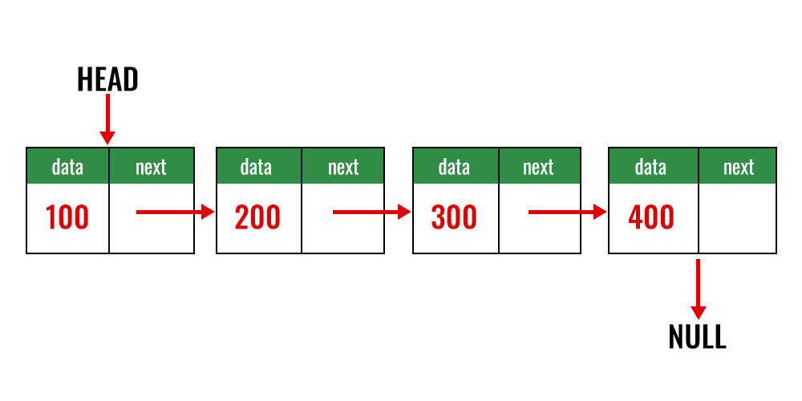
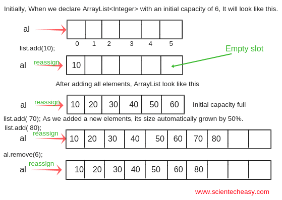
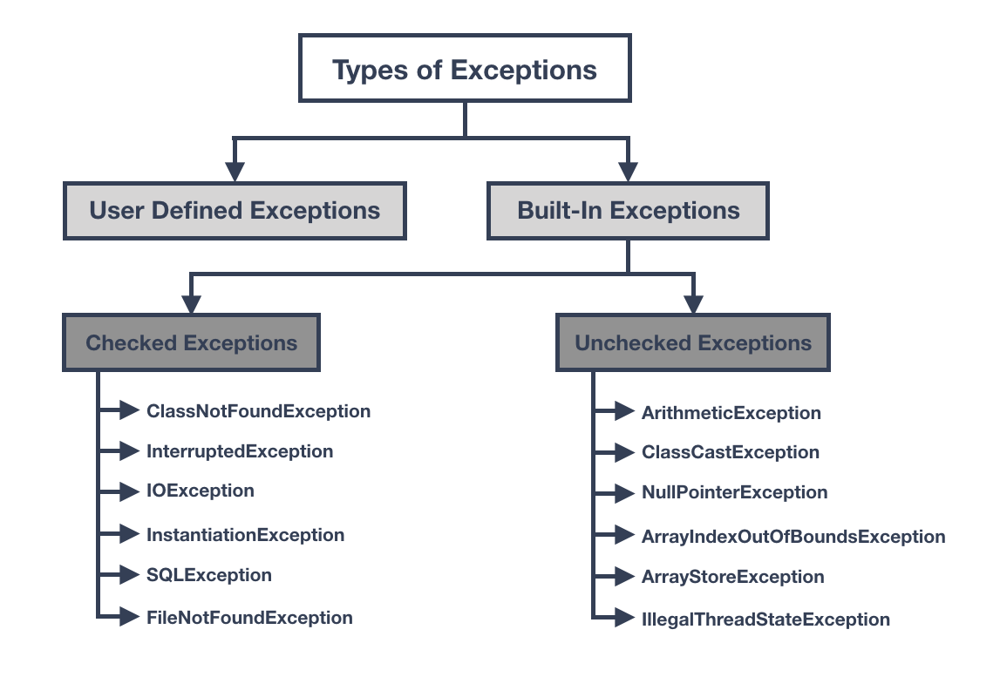
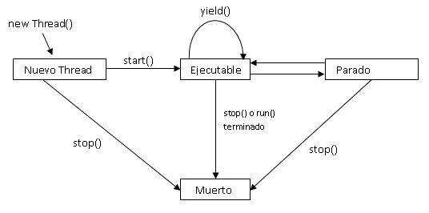
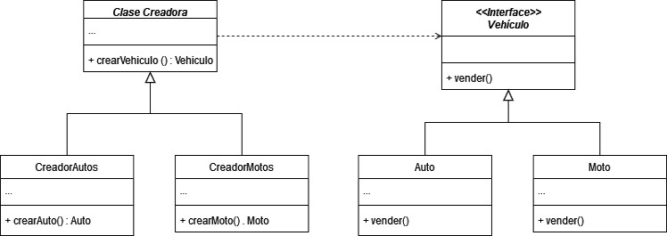
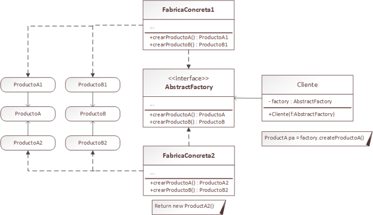
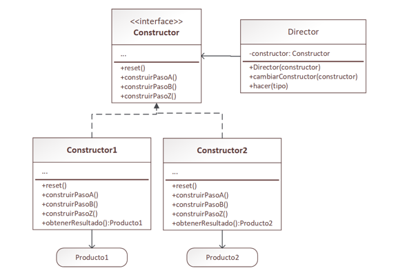
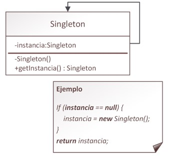

# Java
# Índice
- [Variables](#variables)
	- [Tipos de datos primitivos](#tipos-de-datos-primitivos)
	- [Tipos de datos de referencia](#tipos-de-datos-de-referencia)
	- [Declaración e inicialización de variables](#declaración-e-inicialización-de-variables)
- [Operadores de Lectura y Escritura](#operadores-de-lectura-y-escritura)
	- [Lectura de datos](#lectura-de-datos)
	- [Escritura de datos](#escritura-de-datos)
- [Arrays](#arrays)
- [Collections](#collections)
	- [List](#list)
		- [LinkedList](#linkedlist)
		- [ArrayList](#arraylist)
	- [Map](#map)
- [Métodos](#métodos)
	- [Métodos con retorno](#métodos-con-retorno)
	- [Métodos void](#métodos-void)
	- [Método main](#método-main)
- [POO](#poo)
	- [Clases](#clases)
	- [Objetos](#objetos)
	- [Métodos](#métodos)
		- [Constructores](#constructores)
		- [Getters](#getters)
		- [Setters](#setters)
		- [toString](#tostring)
	- [Métodos y Propiedades Estáticas](#métodos-y-propiedades-estáticas)
	- [Instanciar una clase](#instanciar-una-clase)
		- [Instanciar mediante constructor con parámetros](#instanciar-mediante-constructor-con-parámetros)
		- [Instanciar mediante constructor vacio](#instanciar-mediante-constructor-vacio)
	- [Abstracción](#abstracción)
	- [Encapsulamiento](#encapsulamiento)
	- [Herencia](#herencia)
	- [Polimorfismo](#polimorfismo)
	- [Clases Abstractas](#clases-abstractas)
	- [Interfaces](#interfaces)
- [Generics](#generics)
- [Exepciones](#Excepciones)
	- [Tipos de exepciones](#tipos-de-excepciones)
	- [Excepciones propias de Java](#excepciones-propias-de-java)
		- [Excepciones verificadas Checked Exceptions](#excepciones-verificadas-checked-exceptions)
		- [Excepciones no verificadas Unchecked Exceptions](#excepciones-no-verificadas-unchecked-exceptions)
	- [Excepciones personalizadas](#excepciones-personalizadas)
- [JDBC](#jdbc)
	- [Establecer la conexión](#establecer-la-conexión)
	- [Declaración SQL](#declaración-sql)
- [ORM](#orm)
- [JPA](#jpa)
	- [Unidad de persistencia](#unidad-de-persistencia)
	- [Annotations](#annotations)
	- [Controllers](#controllers)
	- [CRUD](#crud)
		- [CREATE](#create)
		- [DESTROY Y EDIT](#destroy-y-edit)
		- [FIND Y FIND ENTITIES](#find-y-find-entities)
- [Programación funcional](#programación-funcional)
	- [Funciones Lambda](#funciones-lambda)
	- [Referencias a métodos o Double Colon](#referencias-a-métodos-o-double-colon)
	- [Streams](#streams)
	- [Optionals](#optionals)
- [Threads](#threads)
	- [Ciclo de vida](#ciclo-de-vida)
	- [Mediante la clase Thread](#mediante-la-clase-thread)
	- [Mediante la interface Runnable](#mediante-la-interface-runnable)
	- [Métodos sincronizados ](#métodos-sincronizados )
- [Patrones de diseño](#patrones-de-diseño)
	- [Creacionales](#creacionales)
	- [Estructurales](#estructurales)
	- [Comportamiento](#comportamiento)
- [Testing](#testing)
	- [JUnit](#junit)
		- [Anotaciones principales en JUnit](#anotaciones-principales-en-junit)
		- [Assertions](#assertions)
		- [Anotaciones adicionales](#anotaciones-adicionales)
	- [Mockito](#mockito)
		- [Anotaciones principales en Mockito](#anotaciones-principales-en-mockito)
		- [Métodos comunes](#métodos-comunes)
		- [Casos Avanzados](#casos-avanzados)
# Frameworks:
- [Spring Boot](https://github.com/jose-016al/Spring-Boot)
# Variables
En Java, como en cualquier lenguaje de programación, las variables son espacios reservados en la memoria diseñados para almacenar datos. Cada variable tiene un tipo de dato definido, el cual determina qué tipo de información puede contener.

Los tipos de datos en Java se clasifican en dos categorías principales: **tipos de datos primitivos**, que representan valores simples, y **tipos de datos de referencia**, que se utilizan para objetos y estructuras más complejas.
## Tipos de datos primitivos
Los tipos de datos primitivos representan valores básicos y se almacenan directamente en la memoria. Los más destacados incluyen:

| **Tipo de dato** | **Tamaño**  | **Descripción**                                              |
| ---------------- | ----------- | ------------------------------------------------------------ |
| **byte**         | 8 bits      | Almacena valores enteros en el rango de -128 a 127.          |
| **short**        | 16 bits     | Almacena valores enteros en un rango más amplio que `byte`.  |
| **int**          | 32 bits     | Almacena valores enteros en un rango aún más amplio.         |
| **long**         | 64 bits     | Almacena valores enteros muy grandes.                        |
| **float**        | 32 bits     | Representa números de punto flotante con precisión limitada. |
| **double**       | 64 bits     | Representa números de punto flotante con mayor precisión.    |
| **char**         | 16 bits     | Almacena un único carácter Unicode.                          |
| **boolean**      | No definido | Representa valores booleanos: `true` o `false`.              |
## Tipos de datos de referencia
Los tipos de datos de referencia se utilizan para trabajar con instancias de clases en lugar de tipos primitivos. Una variable de tipo referencia no almacena directamente el valor del objeto, sino una conexión hacia este. A través de dicha conexión, es posible acceder a los métodos y atributos del objeto.

| **Tipo de dato de referencia** | **Descripción**                                                                      |
| ------------------------------ | ------------------------------------------------------------------------------------ |
| **String**                     | Se utiliza para almacenar cadenas de caracteres.                                     |
| **Clases personalizadas**      | Permiten crear clases propias para representar datos o estructuras personalizadas.   |
| **Colecciones**                | Se utilizan para almacenar y gestionar grupos de elementos, como listas o conjuntos. |
| **Interfaces**                 | Definen métodos que deben ser implementados por las clases que las utilicen.         |
| **Tipos enumerados (enum)**    | Definen un conjunto fijo de valores constantes.                                      |
## Declaración e inicialización de variables
Para declarar una variable en Java, es necesario especificar su tipo de dato seguido de un nombre. Es fundamental que las variables **se declaren antes de usarse** y que los tipos de datos **coincidan con los valores que se les asignen**.

La asignación de valores se realiza mediante el símbolo de igual (`=`). Por defecto, los tipos de datos primitivos se inicializan con un valor predeterminado, mientras que las variables de referencia se inicializan con `null` si no se les asigna un valor explícito. 
```java
int edad = 35;
double altura = 1.80;
char letra =’a’;
boolean bandera = false;
String cadena = “Hola mundo”;
```
# Operadores de Lectura y Escritura
En **Java**, la lectura y escritura de datos se realizan comúnmente utilizando la clase `Scanner` para leer datos desde el teclado y el método `System.out.println()` para mostrarlos en pantalla.
## Lectura de datos
La clase `Scanner` permite leer datos desde la entrada estándar (como el teclado) o desde otros flujos de entrada. Para utilizarla, primero es necesario importar la clase y luego crear una instancia de esta.

`Scanner` ofrece una variedad de métodos, generalmente prefijados con `next`, que se utilizan para leer diferentes tipos de datos según el tipo requerido o el sistema de entrada seleccionado. A continuación, se detallan algunos de estos métodos:

| **Método**        | **Descripción**                                                                                                 |
| ----------------- | --------------------------------------------------------------------------------------------------------------- |
| **next()**        | Lee la siguiente cadena de caracteres hasta un espacio en blanco o salto de línea. Devuelve la cadena leída.    |
| **nextLine()**    | Lee la línea completa de texto, incluyendo espacios y caracteres especiales. Devuelve la línea como una cadena. |
| **nextInt()**     | Lee el siguiente valor entero. Lanza una excepción si el valor no es un número entero válido.                   |
| **nextDouble()**  | Lee el siguiente número con decimales. Lanza una excepción si el valor no es un decimal válido.                 |
| **nextBoolean()** | Lee el siguiente valor booleano (`true` o `false`). A menudo se utiliza para respuestas de sí/no.               |
| **nextByte()**    | Lee el siguiente valor como un byte.                                                                            |
| **nextShort()**   | Lee el siguiente valor como un short.                                                                           |
| **nextLong()**    | Lee el siguiente valor como un long.                                                                            |
| **nextFloat()**   | Lee el siguiente valor como un float.                                                                           |
```java
import java.util.Scanner; // Importamos la clase Scanner

public class LecturaConScanner {
    public static void main(String[] args) {
            // Creamos una instancia de Scanner
        Scanner input = new Scanner(System.in); 

        System.out.print("Ingrese su nombre: ");
            // Leemos una línea de texto
        String nombre = input.nextLine(); 
        System.out.println("Hola, " + nombre);

        System.out.print("Ingrese su edad: ");
            // Leemos un número entero
        int edad = input.nextInt(); 
        System.out.println("Tienes " + edad + " años.");

            // Cierra el scanner cuando ya no se necesita. Esto es OPCIONAL
        input.close(); 
    }
}
```
## Escritura de datos
El método `System.out.println()` se utiliza para mostrar datos en la salida estándar (generalmente la consola). Es ideal para imprimir mensajes, resultados o cualquier tipo de información que desees comunicar al usuario a través de la consola.

Por defecto, `System.out.println()` añade un salto de línea al final del mensaje. Sin embargo, si queremos que la información introducida aparezca en la misma línea que el mensaje, podemos omitir el `ln` y usar `System.out.print()`, que no agrega el salto de línea al final.
```java
public class EscrituraConSystemOut {
    public static void main(String[] args) {
        
        int suma = 35 + 2;
        System.out.println(“El resultado de la suma es: ” + suma);
    }
}
```
# Arrays
En Java, los arrays son estructuras de datos que permiten almacenar múltiples elementos del mismo tipo en una sola variable. A diferencia de lenguajes como JavaScript, donde los arrays son dinámicos y no es necesario especificar su tamaño al crearlos, en Java debes declarar el tamaño del array al momento de su creación, lo que significa que una vez creado, su tamaño no puede cambiar. Este concepto se conoce como **array de tamaño fijo**.

Para crear un array en Java, primero se define el tipo de dato que almacenará, seguido de los corchetes `[]`, y luego se especifica el tamaño entre corchetes o se inicializa con los valores deseados. Ejemplo:
```java
    // Array de 5 enteros
int[] numeros = new int[5]; 
```
O también puedes inicializar un array con valores:
```java
    // Array de 5 enteros con valores predefinidos
int[] numeros = {1, 2, 3, 4, 5}; 
```
# Collections
En Java, las **colecciones** se refieren a estructuras de datos utilizadas para almacenar y organizar grupos de objetos. Son fundamentales en la programación y están incluidas en la biblioteca estándar de Java a través de diversas clases e interfaces. Las colecciones facilitan el almacenamiento, la manipulación y la gestión eficiente de datos, como listas, conjuntos, mapas, entre otros.

A grandes rasgos, las colecciones son similares a los arrays, pero con la ventaja de que no es necesario especificar un tamaño fijo al crearlas. A diferencia de los arrays, las colecciones pueden crecer dinámicamente según sea necesario. Además, las colecciones ofrecen muchas funcionalidades adicionales que facilitan el manejo y la manipulación de datos.
## List
**List** es una interfaz en Java que se utiliza para almacenar una colección de objetos en un orden específico. Como su nombre indica, representa una **lista** de elementos. Dependiendo de la forma en que se organizan sus elementos, una lista puede adoptar diferentes implementaciones, como **LinkedList** o **ArrayList**, cada una con características y ventajas particulares.

| **Método**            | **Descripción**                                                                             |
| --------------------- | ------------------------------------------------------------------------------------------- |
| `add(E e)`            | Agrega un elemento al final de la lista.                                                    |
| `add(int index, E e)` | Inserta un elemento en la posición especificada de la lista.                                |
| `get(int index)`      | Devuelve el elemento en la posición especificada de la lista.                               |
| `set(int index, E e)` | Reemplaza el elemento en la posición especificada con el nuevo valor.                       |
| `remove(int index)`   | Elimina el elemento en la posición especificada.                                            |
| `remove(Object o)`    | Elimina la primera aparición del objeto especificado en la lista.                           |
| `size()`              | Devuelve el número de elementos en la lista.                                                |
| `isEmpty()`           | Devuelve `true` si la lista está vacía, `false` si tiene elementos.                         |
| `contains(Object o)`  | Devuelve `true` si la lista contiene el objeto especificado.                                |
| `indexOf(Object o)`   | Devuelve el índice de la primera aparición del objeto en la lista, o -1 si no se encuentra. |
| `clear()`             | Elimina todos los elementos de la lista.                                                    |
| `toArray()`           | Devuelve un arreglo que contiene todos los elementos de la lista.                           |
### LinkedList
**LinkedList** es una clase que implementa la interfaz **List** en Java. Almacena los elementos en una estructura de lista doblemente enlazada, lo que permite recorrerla en ambas direcciones. Es muy eficiente para realizar inserciones o eliminaciones en cualquier parte de la lista, pero no tan eficiente para el acceso a los elementos mediante índices. Su principal ventaja radica en su rendimiento cuando se requieren frecuentes inserciones o eliminaciones, lo que la hace ideal para proyectos que involucren estos tipos de operaciones.
```java
import java.util.LinkedList;
LinkedList<String> miLinkedList = new LinkedList<>();
```

### ArrayList
**ArrayList** en Java es una estructura de datos que se utiliza para almacenar una colección de elementos de manera flexible y dinámica. Esto significa que puedes agregar o eliminar elementos de forma eficiente sin tener que preocuparte por el tamaño inicial de la lista.

Internamente, **ArrayList** utiliza un arreglo (array) para almacenar los elementos. Aunque su tamaño inicial es fijo, cuando se llena, el ArrayList se redimensiona automáticamente para acomodar más elementos. El acceso a los elementos por índice es rápido y constante, lo que lo hace eficiente cuando se necesita recuperar datos rápidamente. Sin embargo, las operaciones de inserción o eliminación en el medio de la lista pueden ser costosas, ya que requieren desplazar los elementos para mantener la estructura del arreglo.
```java
import java.util.ArrayList;
ArrayList<String> miLista = new ArrayList<>();
```

## Map
Un **Map** es una estructura de datos que se utiliza para almacenar pares de clave-valor, lo que significa que asocia un valor con una clave única. Esto resulta útil cuando necesitas vincular datos relacionados. Por ejemplo, en un diccionario, buscas una palabra (clave) para obtener su definición (valor). De manera similar, en Java, un **Map** te permite buscar un valor específico proporcionando su clave correspondiente.

Algunas características clave de los **Map** en Java son:

- **No permite claves duplicadas**: Cada clave en un **Map** debe ser única, por lo que no puedes tener dos claves iguales con valores diferentes.
- **Eficiencia en la búsqueda**: Los **Map** están diseñados para permitir búsquedas rápidas de valores asociados con una clave, utilizando estructuras de datos optimizadas como tablas hash o árboles.
- **Implementaciones variadas**: En Java, existen varias implementaciones de la interfaz **Map**, como **HashMap**, **TreeMap** y **LinkedHashMap**, cada una con diferentes comportamientos y características.
- **Útiles para almacenamiento de configuraciones y asociaciones**: Los **Map** son ideales para almacenar configuraciones de aplicaciones, datos relacionados y asociaciones clave-valor en general.

| **Método**                               | **Descripción**                                                                                    |
| ---------------------------------------- | -------------------------------------------------------------------------------------------------- |
| `put(K key, V value)`                    | Asocia el valor especificado con la clave especificada. Si la clave ya existe, reemplaza el valor. |
| `get(Object key)`                        | Devuelve el valor asociado con la clave especificada, o `null` si la clave no existe en el mapa.   |
| `remove(Object key)`                     | Elimina la entrada con la clave especificada.                                                      |
| `containsKey(Object key)`                | Devuelve `true` si el mapa contiene una entrada para la clave especificada.                        |
| `containsValue(Object value)`            | Devuelve `true` si el mapa contiene una o más entradas para el valor especificado.                 |
| `size()`                                 | Devuelve el número de entradas en el mapa.                                                         |
| `isEmpty()`                              | Devuelve `true` si el mapa no contiene elementos, `false` en caso contrario.                       |
| `keySet()`                               | Devuelve un conjunto (`Set`) de todas las claves contenidas en el mapa.                            |
| `values()`                               | Devuelve una colección de todos los valores contenidos en el mapa.                                 |
| `entrySet()`                             | Devuelve un conjunto (`Set`) de todas las entradas (pares clave-valor) contenidas en el mapa.      |
| `putAll(Map<? extends K,? extends V> m)` | Inserta todas las entradas de otro mapa en el mapa actual.                                         |
| `clear()`                                | Elimina todas las entradas del mapa.                                                               |
```java
import java.util.HashMap;
import java.util.Map;
public class EjemploMap {
    public static void main(String[] args) {
    
            // Crear un Map que relaciona nombres con edades
        Map<String, Integer> edades = new HashMap<>();
        
            // Agregar valores al Map
        edades.put("Juan", 25);
        edades.put("María", 30);
        edades.put("Pedro", 22);
        
            // Obtener el valor asociado a una clave
        int edadJuan = edades.get("Juan"); // Devolverá 25
            
            // Verificar si una clave existe en el Map
        boolean existeAna = edades.containsKey("Ana"); // Devolverá false
    }
}
```
# Métodos
Un **método** es un bloque de código con un nombre asociado que realiza una tarea específica. Los métodos se definen una vez y pueden ejecutarse (o "llamarse") en cualquier parte del programa tantas veces como sea necesario.
## Métodos con retorno
Un método con retorno especifica un tipo de retorno en su declaración (por ejemplo, `int`, `String`, `double`, etc.). El valor que regresa debe coincidir con el tipo definido. Estos métodos utilizan la palabra clave `return` para devolver un valor.
```java
public int sumar(int a, int b) {
    return a + b;
}
```
## Métodos void
La palabra clave `void` se utiliza para indicar que el método no tiene un valor de retorno. Estos métodos suelen realizar una acción, como imprimir algo en la consola, modificar variables o interactuar con un sistema externo.
```java
public void imprimirMensaje(String mensaje) {
    System.out.println(mensaje);
}
```
## Método main
El método `main` es el punto de entrada de ejecución para cualquier programa Java. Es donde el programa comienza a ejecutarse.
```java
public static void main(String[] args) {
	// content
}
```

- **`public`**: Es público para que la JVM (Java Virtual Machine) pueda acceder a él desde cualquier lugar.
- **`static`**: Es estático para que no sea necesario crear una instancia de la clase para ejecutarlo.
- **`void`**: No devuelve ningún valor, lo que lo clasifica como un método sin retorno.
- **`String[] args`**: Es un parámetro que permite pasar argumentos desde la línea de comandos al programa.
# POO
La **Programación Orientada a Objetos (POO)** es un paradigma de programación que organiza el diseño y desarrollo de software en torno a **objetos**, entidades que combinan datos (atributos) y comportamientos (métodos). Este enfoque se inspira en la idea de modelar elementos del mundo real en sistemas informáticos, permitiendo una representación más modular, intuitiva y reutilizable.

En la POO, cada objeto representa una entidad específica con propiedades y acciones propias, facilitando la interacción entre ellos y el diseño de soluciones complejas de manera organizada.
## Clases
Una **clase** en programación puede considerarse como un plano o plantilla que define cómo deben ser los objetos. Por ejemplo, si deseamos modelar una **persona** en una aplicación, la clase sería la estructura que define las propiedades y comportamientos que esa persona tendrá dentro del programa.

Al crear una clase, es importante hacerse las siguientes preguntas respecto al objeto que queremos representar:

- ¿Qué características o propiedades tiene este objeto en la vida real? (atributos)
- ¿Qué acciones o comportamientos puede realizar este objeto? (métodos o funciones)
```java
public class Persona {
        //atributos de la clase
    private int id;
    private String nombre;
    private int edad;
    private String direccion;
    private String numeroTelefono;

        //métodos de la clase
    public void caminar () {
        //lo que hace el método...
    }
}
```
## Objetos
Un **objeto** es una representación concreta creada a partir de una clase. Es la entidad real que encapsula atributos y comportamientos definidos por la clase, y cada objeto puede tener valores únicos para sus atributos.

Una **instancia** se refiere a un **objeto específico creado a partir de una clase**, es decir, cada vez que generas un objeto usando una clase, estás creando una instancia de esa clase.
## Métodos 
Los **métodos** definen los comportamientos que los objetos pueden realizar, respondiendo a la pregunta: **¿Qué puede hacer el objeto?**

Existen tres tipos de métodos esenciales que **todas las clases deberían incluir** para garantizar su funcionalidad básica:
### Constructores
Los **constructores** son métodos especiales dentro de una clase que se utilizan para inicializar los objetos cuando se crean. Pueden ser de dos tipos principales:

- **Sin parámetros (constructor por defecto):** No reciben datos y asignan valores predeterminados a los atributos.
```java
public Persona () {}
```
- **Con parámetros:** Reciben valores que permiten personalizar la inicialización de los atributos del objeto.
```java
public Persona(int id, String nombre, int edad, String direccion, String numeroTelefono) {
    this.id = id;
    this.nombre = nombre;
    this.edad = edad;
    this.direccion = direccion;
    this.numeroTelefono = numeroTelefono;
}
```
### Getters
Los **métodos getters** permiten consultar los valores de los atributos de un objeto, proporcionando una forma controlada de acceder a sus datos.
```java
public int getId() {
    return id;
}

public String getNombre() {
    return nombre;
}

public int getEdad() {
    return edad;
}

public String getDireccion() {
    return direccion;
}

public String getNumeroTelefono() {
    return numeroTelefono;
}
```
### Setters
Los **métodos setters** permiten asignar o modificar los valores de los atributos de un objeto, proporcionando un control sobre cómo se establecen sus datos.
```java
public void setId(int id) {
    this.id = id;
}

public void setNombre(String nombre) {
    this.nombre = nombre;
}

public void setEdad(int edad) {
    this.edad = edad;
}

public void setDireccion(String direccion) {
    this.direccion = direccion;
}

public void setNumeroTelefono(String numeroTelefono) {
    this.numeroTelefono = numeroTelefono;
}
```
### toString
El método `toString` es un método definido en la clase base `Object`, que es la superclase de todas las clases en Java. Su propósito principal es devolver una representación en forma de cadena del objeto.

Por defecto, `toString` devuelve `<NombreDeLaClase>@<HashCode>`, pero podemos sobrescribirlo para mostrar información relevante del objeto, como sus atributos.

`@Override` es una anotación que indica explícitamente que un método en una subclase está sobrescribiendo un método definido en una superclase o interfaz. No es obligatorio utilizarla, pero su inclusión aporta beneficios importantes.
```java
@Override
public String toString() { 
    return "Persona {nombre='" + nombre + "', edad=" + edad + "}"; 
}
```
## Métodos y Propiedades Estáticas
Podemos definir **propiedades y métodos estáticos** dentro de una clase utilizando la palabra clave `static`. Los miembros estáticos pertenecen a la **clase en sí misma**, no a una instancia de la clase, lo que significa que **no es necesario crear un objeto para usarlos**.
### Declarar Propiedades y Métodos Estáticos
Para declarar una **propiedad o método estático**, se utiliza `static` dentro de la clase, de la siguiente manera:
```java
public class Ejemplo {
    public static String variableEstatica = "Soy estática";
    
    public static String metodoEstatico() {
        return "Este es un método estático";
    }
}
```
Aquí, `variableEstatica` y `metodoEstatico()` son **estáticos** y pertenecen a la **clase**, no a una instancia.
### Acceder a Miembros Estáticos
Los miembros estáticos **pertenecen a la clase**, por lo que se accede a ellos utilizando el nombre de la clase seguido de `.` (punto), en lugar de crear una instancia de la clase:
```java
System.out.println(Ejemplo.variableEstatica); // Acceder a una propiedad estática
System.out.println(Ejemplo.metodoEstatico());  // Llamar a un método estático
```
No es necesario crear un objeto con `new Ejemplo()`, ya que los miembros estáticos **existen desde el momento en que se carga la clase**.
### Uso de Propiedades Estáticas Dentro de la Misma Clase
Cuando una clase necesita acceder a sus propios miembros estáticos, se utiliza `this` o directamente el nombre de la clase, pero **no se utiliza `this` para acceder a propiedades estáticas**. A continuación se muestra un ejemplo de cómo hacerlo:
```java
public class Prueba {
    public static String mensaje = "Hola desde static";

    public static String mostrarMensaje() {
        return mensaje; // Se puede usar directamente la propiedad estática
    }
}

System.out.println(Prueba.mostrarMensaje()); // "Hola desde static"
```
Diferencia entre el uso de `this` y el acceso a miembros estáticos:
- **`this`** se usa para acceder a **miembros de instancia** (no estáticos).
- **`Clase.nombreDeMiembro`** (sin `this`) se usa para acceder a **propiedades y métodos estáticos** dentro de la clase.
## Instanciar una clase
Existen diversas formas de instanciar una clase, dependiendo del contexto y de cómo se planea asignar o almacenar datos en el objeto creado. Recordemos que **instanciar una clase** significa crear un objeto, y para ello utilizamos los **constructores** definidos en la clase.

- **`Persona`** es la clase que actúa como el plano o plantilla, definiendo las características (atributos) y comportamientos (métodos) de cualquier "persona".
- **`persona1`** es el **objeto**, es decir, una representación concreta de una persona basada en la clase `Persona`.
- **`persona1`** también se denomina **instancia de la clase `Persona`**, ya que es un objeto específico creado usando esa plantilla.

Siguiendo con el ejemplo de la clase `Persona`, exploremos dos formas comunes de hacerlo:
### Instanciar mediante constructor con parámetros
Se crea una instancia de la clase `Persona` utilizando un **constructor con parámetros**, lo que permite asignar los valores de los atributos del objeto de manera directa y en una sola línea, simplificando el proceso de inicialización.
```java
Persona persona = new Persona(2, "María", 25, "456 Calle Secundaria", "555-987-6543");
```
### Instanciar mediante constructor vacio
```java
Persona persona1 = new Persona(); // Se crea un objeto vacío

/*cuando tengamos los datos (en cualquier momento de la ejecución del programa)
los asignamos mediante los métodos setters*/
persona1.setId(1);
persona1.setNombre("Juan");
persona1.setEdad(30);
persona1.setDireccion("123 Calle Principal");
persona1.setNumeroTelefono("555-123-4567");
```
## Abstracción
La **abstracción**  se refiere al proceso de simplificar conceptos complejos del mundo real para representarlos de manera lógica y manejable en nuestras aplicaciones. Este enfoque permite centrarse en las características y comportamientos esenciales de un objeto, ignorando los detalles innecesarios.

Para implementar una abstracción efectiva, podemos seguir estos pasos:

1. **Identificación de conceptos clave:**
	- Lo primero es determinar qué elementos importantes del mundo real queremos representar en nuestro programa.
    - Por ejemplo, en una aplicación para gestionar una biblioteca, podríamos identificar conceptos como **Libro**, **Préstamo** y **Lector**.
2. **Simplificación de los conceptos:**
    - A continuación, reducimos estos conceptos a sus características más relevantes, eliminando detalles secundarios.
    - Por ejemplo, para un **Libro**, podríamos enfocarnos en propiedades como **título**, **autor** y **cantidad disponible**, omitiendo detalles como el peso o color.
3. **Creación de clases:**
    - Cada concepto identificado se representa mediante una **clase**, que incluye:
        - **Atributos:** para almacenar las características relevantes del objeto.
        - **Métodos:** para definir las acciones o comportamientos que puede realizar el objeto.
    - Por ejemplo, una clase **Libro** podría tener atributos como `titulo` y `autor`, y métodos como `prestar()` o `devolver()`.
4. **Uso de las clases en el programa:**
    - Una vez creadas las clases, podemos utilizarlas para generar **objetos**, que son instancias específicas de los conceptos.
    - Por ejemplo, un objeto de la clase **Libro** podría representar un libro específico en la biblioteca.

```java
// Clase que representa un libro
public class Libro {
    private String titulo;
    private String autor;
    private int cantidadDisponible;

    // Constructor
    public Libro(String titulo, String autor, int cantidadDisponible) {
        this.titulo = titulo;
        this.autor = autor;
        this.cantidadDisponible = cantidadDisponible;
    }

    // Método para prestar un libro
    public void prestar() {
        if (cantidadDisponible > 0) {
            cantidadDisponible--;
            System.out.println("El libro '" + titulo + "' ha sido prestado.");
        } else {
            System.out.println("No hay copias disponibles de '" + titulo + "'.");
        }
    }

    // Método para devolver un libro
    public void devolver() {
        cantidadDisponible++;
        System.out.println("El libro '" + titulo + "' ha sido devuelto.");
    }
}
```
## Encapsulamiento
**Encapsulamiento** es un pilar fundamental de la programación orientada a objetos. Este concepto consiste en **ocultar los detalles internos** de un objeto y exponer únicamente un conjunto de métodos públicos para interactuar con él. En esencia, el encapsulamiento actúa como un "escudo protector" para los datos de un objeto, garantizando que solo puedan modificarse o accederse de manera controlada y segura.

**Ejemplo práctico:**  
_Imagina un automóvil como un objeto. Este automóvil tiene **datos internos**, como la velocidad y la cantidad de gasolina, y **acciones** que puedes realizar, como acelerar y frenar.   Con el encapsulamiento , no puedes alterar directamente la velocidad o la cantidad de gasolina. En su lugar, debes utilizar métodos como `acelerar()` o `recargarGasolina()`, que controlan cómo se modifica el estado interno del automóvil. Esto asegura que los datos, como la velocidad, siempre permanezcan dentro de un rango válido y que el automóvil funcione correctamente._
### Modificadores de acceso
Los **modificadores de acceso** son palabras clave que establecen los niveles de visibilidad de atributos y métodos en una clase, determinando qué partes del programa pueden interactuar con ellos. Los más comunes son:
#### Public
Cuando una variable o método se declara como **público** (`public`), se vuelve accesible desde cualquier parte del programa. Esto significa que otras clases, paquetes o módulos pueden interactuar con estos elementos sin restricciones, permitiendo su uso de manera global.
```java
public class Auto {

    public double litrosGasolina;
    public double velocidad;
    
    public void acelerar() {
        // Código aquí
    }
}
```
#### Private
Cuando una variable o método se declara como **privado** (`private`), solo puede ser accedido dentro de la misma clase. Esto oculta los detalles internos de la clase, garantizando que no sean modificados ni accedidos directamente desde fuera, lo que ayuda a proteger la integridad de los datos y promueve el principio de **encapsulamiento**.
```java
public class Auto {

    private double litrosGasolina;
    private double velocidad;
    
    private void acelerar() {
        // Código aquí
    }
}
```
#### Protected
Este modificador permite el acceso a las clases dentro del mismo paquete y a las subclases (clases derivadas) que heredan de la clase que contiene el elemento protegido. Esto resulta útil en el contexto de la **herencia**, ya que las subclases pueden acceder a los miembros protegidos de la clase base, facilitando la reutilización y extensión del código (un concepto que exploraremos más adelante).
```java
public class Auto {

    protected double litrosGasolina;
    protected double velocidad;
    
    protected void acelerar() {
        // Código aquí
    }
}
```
## Herencia
La **herencia** en programación permite que una clase **hija** herede características (atributos y métodos) de una clase **padre**. Esto facilita la reutilización de código y la extensión de funcionalidades. Es similar a la herencia en la vida real, donde los hijos heredan rasgos de sus padres. Por ejemplo, una clase **Animal** puede tener métodos comunes como **comer**, mientras que clases como **Perro** y **Gato** heredan esos métodos, pero también pueden agregar los suyos propios (como **ladrar** o **maullar**). La palabra clave **extends** se usa para indicar la herencia, y **super** se usa para acceder a los atributos de la clase padre.
```java
//ejemplo clase animal en código
public class Animal {

    String nombre;
    int edad;
    
    public Animal(String nombre, int edad) {
        this.nombre = nombre;
        this.edad = edad;
    }
    
    public void comer() {
        System.out.println(nombre + " está comiendo.");
    }
}
```
Subclase **Perro** heredada de **Animal**
```java
// Clase "Perro" que hereda de "Animal"
class Perro extends Animal {

    public Perro(String nombre, int edad) {
        super(nombre, edad);
    }
    
    public void ladrar() {
        System.out.println(nombre + " está ladrando.");
    }
}
```
Subclase **Gato** heredada de **Animal**
```java
// Clase "Gato" que hereda de "Animal"
class Gato extends Animal {

     public Gato(String nombre, int edad) {
        super(nombre, edad);
    }
    
    public void maullar() {
        System.out.println(nombre + " está maullando.");
    }
}
```
Para ejecutar un ejemplo en el método `main` de nuestro proyecto, podríamos hacer lo siguiente:
```java
public class Main {
    public static void main(String[] args) {
        
        Perro miPerro = new Perro("Rocco", 3);
        Gato miGato = new Gato("Pelusa", 2);
        
        miPerro.comer();
        miPerro.ladrar();
        miGato.comer();
        miGato.maullar();
    }
}
```
## Polimorfismo
El polimorfismo, que proviene de "poli" (muchos) y "morfismo" (formas), permite que diferentes clases utilicen métodos con el mismo nombre pero con comportamientos distintos, según su propia implementación. Está relacionado con la **sobrecarga** (definir métodos con el mismo nombre pero diferentes parámetros) y la **sobreescritura** (modificar métodos heredados).

`@Override` es una anotación que indica explícitamente que un método en una subclase está sobrescribiendo un método definido en una superclase o interfaz. No es obligatorio utilizarla, pero su inclusión aporta beneficios importantes.

**Ejemplo:** Si tienes una clase `Animal` con el método `emitirSonido`, las subclases como `Perro` y `Gato` pueden sobrescribir este método para emitir sonidos diferentes, aunque todos usen el mismo nombre para el método.
```java
public class Animal {
    public void emitirSonido() {
        System.out.println("El animal hace un sonido genérico.");
    }
}

public class Perro extends Animal {
    public void emitirSonido() {
        System.out.println("Guauu Guauu");
    }
}

public class Gato extends Animal {
    public void emitirSonido() {
        System.out.println("Miauuuuuu");
    }
}
```
## Clases abstractas
**Una clase abstracta** es una clase especial que no puede ser instanciada directamente, es decir, no se pueden crear objetos a partir de ella. En lugar de ello, se utiliza como una plantilla o modelo para definir clases derivadas. Las clases abstractas pueden contener tanto **métodos abstractos** (que no tienen implementación) como **métodos concretos** (que sí tienen implementación).

Entre las principales características de las clases abstractas se incluyen:

1. **Palabra clave `abstract`**: Para declarar una clase abstracta, se utiliza la palabra clave `abstract` antes de la palabra `class`. Esto indica que la clase no se puede instanciar directamente.
2. **Métodos abstractos**: Una clase abstracta puede tener métodos abstractos (sin cuerpo/implementación) y métodos concretos (con implementación). **Es obligatorio que una clase abstracta tenga al menos un método abstracto**, de lo contrario, no sería necesaria que fuera abstracta.    
3. **Herencia**: Las clases concretas (clases que pueden ser instanciadas) pueden heredar de una clase abstracta. Cuando una clase concreta hereda de una clase abstracta, está obligada a proporcionar implementaciones para todos los métodos abstractos de la clase base, mediante la sobrecarga (overriding) de estos métodos.

**Ejemplo de Código: Clase Abstracta Vehículo**
```java
public abstract class Vehiculo {

    String marca;
    
    public Vehiculo(String marca) {
        this.marca = marca;
    }
    
        //métodos abstractos (sin implementación)
    public abstract void arrancar();
    public abstract void detener();

        //método implementado
    public void limpiarParabrisas() {
      System.out.println("Limpiando parabrisas");
    }
}
```
**Extensión Auto**
```java
public class Auto extends Vehiculo {

    private String placa;
    private String modelo;
    
        // Constructor que llama al constructor de la clase madre/padre
    public Auto(String marca) {
        super(marca);
    }
         // Implementación del método 'arrancar'
    @Override
    public void arrancar() {
        System.out.println("El auto" + marca + " está arrancando.");
    }
        // Implementación del método 'detener'
    @Override
    public void detener() {
        System.out.println("El auto " + marca + " se está deteniendo.");
    }
    //como el método limpiar parabrisas ya está implementado, no es necesario especificarlo acá sino que se accede simplemente a el mediante la "herencia"
}
```
## Interfaces
**Una interfaz** es un tipo especial de clase que se diferencia de las clases tradicionales en que **no puede tener atributos** y está compuesta únicamente por **métodos abstractos**, es decir, métodos sin implementación. Las interfaces permiten simular la **herencia múltiple**, algo que no es posible de forma nativa en muchos lenguajes. Esto se logra porque una clase puede implementar varias interfaces al mismo tiempo.

Mientras que las **clases abstractas** sirven como plantillas generales para sus clases hijas, las **interfaces** se enfocan en definir **el comportamiento**. Es decir, una interfaz especifica qué métodos deben ser implementados, pero no cómo deben ser implementados.
```java
public interface Animal {
    public void hacerSonido();
    public void moverse();
}
```
Para implementar una interfaz en una clase, usamos la palabra clave `implements`, seguida del nombre de la interfaz:
```java
public class Perro implements Animal {
    @Override 
    public void hacerSonido() { System.out.println("El perro ladra"); }
    @Override 
    public void moverse() { System.out.println("El perro corre"); }
}
```
# Generics
Los **Generics** en Java son una característica poderosa que permite escribir código más flexible, reutilizable y seguro. Su principal propósito es permitir que las clases, interfaces y métodos operen con tipos específicos, pero dejando que el usuario determine el tipo de dato a utilizar. Esta flexibilidad mejora tanto la **seguridad** como la **legibilidad** del código, mientras fomenta su reutilización sin sacrificar la robustez.

1. **Seguridad de Tipos (Type Safety):** Los Generics proporcionan seguridad de tipos en tiempo de compilación, lo que significa que los errores de tipo se detectan antes de ejecutar el programa. Esto reduce significativamente la posibilidad de errores en tiempo de ejecución.
2. **Reutilización de Código:** Los Generics permiten escribir código que puede trabajar con diferentes tipos de datos sin necesidad de duplicar la lógica. Esto promueve la reutilización del código y facilita el mantenimiento del mismo.
3. **Abstracción de Datos:** Al utilizar Generics, es posible crear estructuras y algoritmos que sean independientes del tipo de dato específico. Esto proporciona un mayor nivel de abstracción, lo que hace el código más general y adaptable a distintos contextos.
#### Ejemplo
Supongamos que tienes una clase Producto que representa un artículo en el inventario:
```java
public class Producto {
    private String nombre;
    private double precio;
    public Producto(String nombre, double precio) {
        this.nombre = nombre;
        this.precio = precio;
    }
    // Getters y setters
}
```
Luego, puedes crear una clase Inventario que utiliza Generics para gestionar el inventario de manera más general:
```java
import java.util.ArrayList;
import java.util.List;
public class Inventario<T extends Producto> {
    private List<T> productos;
    public Inventario() {
        this.productos = new ArrayList<>();
    }
    public void agregarProducto(T producto) {
        productos.add(producto);
        System.out.println("Producto agregado al inventario: " + producto.getNombre());
    }
    public void mostrarInventario() {
        System.out.println("Inventario:");
        for (T producto : productos) {
            System.out.println(producto.getNombre() + " - $" + producto.getPrecio());
        }
    }
    // Otros métodos relacionados con la gestión del inventario
}
```
Ahora, puedes usar la clase Inventario con diferentes tipos de productos. Por ejemplo:
```java
public class TiendaEnLinea {
    public static void main(String[] args) {
        // Crear inventario para electrónicos
        Inventario<Electronico> inventarioElectronico = new Inventario<>();
        inventarioElectronico.agregarProducto(new Electronico("Laptop", 1200.0, "MarcaX"));
        inventarioElectronico.agregarProducto(new Electronico("Smartphone", 800.0, "MarcaY"));
        // Crear inventario para ropa
        Inventario<Ropa> inventarioRopa = new Inventario<>();
        inventarioRopa.agregarProducto(new Ropa("Camiseta", 20.0, "M", "Algodón"));
        inventarioRopa.agregarProducto(new Ropa("Jeans", 50.0, "32", "Denim"));
        // Crear inventario para libros
        Inventario<Libro> inventarioLibros = new Inventario<>();
        inventarioLibros.agregarProducto(new Libro("Java 101", 29.99, "John Doe"));
        inventarioLibros.agregarProducto(new Libro("Historia del Arte", 39.99, "Jane Smith"));
        // Mostrar inventarios
        inventarioElectronico.mostrarInventario();
        inventarioRopa.mostrarInventario();
        inventarioLibros.mostrarInventario();
    }
}
```
# Excepciones
Las excepciones en programación son eventos inusuales que ocurren durante la ejecución de un programa y pueden interrumpir su flujo normal, como dividir por cero o acceder a un índice fuera de rango. Son mecanismos para gestionar errores de forma controlada, evitando bloqueos inesperados. Cuando surge una excepción, el programa la lanza con detalles del error, permitiendo manejarla con acciones como mostrar mensajes, corregir el problema o continuar la ejecución. Usarlas correctamente es esencial para escribir código robusto y estable.

Los **errores** son problemas críticos del sistema, como fallos en la JVM o falta de memoria, que generalmente no pueden manejarse ni recuperarse en el código.

En cambio, las **excepciones** son situaciones previsibles, como operaciones fallidas o condiciones inusuales, que pueden manejarse en el código para tomar acciones correctivas y permitir que el programa continúe.

| **Aspecto**       | **Excepciones**                                                                 | **Errores**                                                                    |
|--------------------|--------------------------------------------------------------------------------|--------------------------------------------------------------------------------|
| **Propósito**      | Manejar situaciones excepcionales y previsibles en el flujo de ejecución.      | Indicar problemas graves en el entorno de ejecución o la infraestructura del sistema. |
| **Gravedad**       | Problemas controlables y recuperables.                                         | Problemas graves e irreparables.                                              |
| **Causa**          | Acciones del usuario, operaciones fallidas o condiciones inusuales.           | Relacionados con el entorno de ejecución, como falta de memoria o fallos en la JVM. |
| **Manejo**         | Se manejan en el código para tomar acciones correctivas y continuar la ejecución. | Generalmente no se manejan en el código porque son irreparables.              |
| **Ejemplos comunes** | `NullPointerException`, `IOException`, `NumberFormatException`.              | `OutOfMemoryError`, `StackOverflowError`, `NoClassDefFoundError`.             |
## Tipos de excepciones
En Java, las excepciones se clasifican en dos categorías principales: **excepciones personalizadas** (definidas por el usuario) y **excepciones integradas** (built-in exceptions) que proporciona el propio lenguaje.

Por otro lado, las excepciones integradas en Java se dividen en dos tipos principales: **excepciones verificadas** (_checked exceptions_) y **excepciones no verificadas** (_unchecked exceptions_). A continuación, exploraremos cada una en detalle.

### Excepciones propias de Java
#### Excepciones verificadas Checked Exceptions
Estas excepciones deben manejarse explícitamente en tu código, ya que el compilador de Java verifica si se han gestionado o declarado correctamente. Las **excepciones verificadas** son subclases de `java.lang.Exception` (excepto aquellas que son subclases de `RuntimeException`). Algunos ejemplos comunes son:

- **`IOException`**: Maneja errores relacionados con la entrada y salida de datos, como la lectura o escritura de archivos.
- **`SQLException`**: Se utiliza para gestionar errores relacionados con bases de datos y consultas SQL.
- **`ClassNotFoundException`**: Ocurre cuando no se encuentra una clase requerida en tiempo de ejecución.
- **`InterruptedException`**: Gestiona excepciones relacionadas con la concurrencia y la administración de hilos.
#### Excepciones no verificadas Unchecked Exceptions
Las **excepciones no verificadas** no requieren manejo explícito y no se validan en tiempo de compilación. Son subclases de `java.lang.RuntimeException` y, por lo general, indican errores en el código que el programador debe corregir. Algunos ejemplos comunes incluyen:

- **`ArithmeticException`**: Se lanza cuando ocurre un error aritmético, como una división por cero.
- **`NullPointerException`**: Ocurre al intentar acceder a un objeto que es nulo.
- **`ArrayIndexOutOfBoundsException`**: Se lanza al intentar acceder a un índice fuera de los límites de un arreglo.
- **`IllegalArgumentException`**: Indica que un argumento proporcionado a un método no es válido.
### Excepciones personalizadas
Una **excepción personalizada** en Java es una excepción que defines tú mismo para gestionar situaciones excepcionales específicas que no pueden abordarse adecuadamente con las excepciones estándar que ofrece el lenguaje. Esto te permite crear clases de excepción propias, con mensajes de error y comportamientos personalizados según tus necesidades.

Para crear una excepción personalizada en Java, sigue estos pasos:
- Define una clase que extienda de `Exception` (o de una subclase adecuada) o implemente la interfaz `Throwable`.
- Agrega constructores personalizados en tu clase según lo requiera tu caso. Estos constructores pueden incluir detalles como mensajes de error o causas de la excepción.
- Opcionalmente, puedes añadir métodos adicionales dentro de tu clase personalizada. Estos métodos pueden proporcionar información extra o ejecutar acciones relacionadas con la excepción.
- Para lanzar tu excepción personalizada, utiliza la palabra clave **`throw`** seguida de una instancia de tu clase de excepción, en cualquier parte de tu código.
- Maneja tu excepción personalizada con bloques `try-catch`, igual que lo harías con las excepciones estándar de Java.
```java
public class DatosInvalidosException extends Exception {
    public DatosInvalidosException(String mensaje) {
        super(mensaje);
    }
}
public class Biblioteca {
    public void agregarLibro(String titulo, String autor, int anioPublicacion) throws DatosInvalidosException {
        if (titulo == null || titulo.isEmpty() || autor == null || autor.isEmpty() || anioPublicacion < 0) {
            throw new DatosInvalidosException("Los datos del libro son inválidos.");
        }
            // Lógica para agregar el libro a la biblioteca
    }
}
```
# JDBC
**JDBC** (Java Database Connectivity) es una API (Interfaz de Programación de Aplicaciones) de Java que permite la interacción con bases de datos relacionales. Proporciona una forma estándar y orientada a objetos para acceder a bases de datos, facilitando operaciones como la conexión, consulta, inserción, actualización y eliminación de datos en bases de datos directamente desde aplicaciones Java.
## Establecer la conexión
En este paso, creamos una clase que gestionará la configuración y la conexión con la base de datos. Especificamos la URL de la base de datos, el nombre de usuario y la contraseña necesarios para acceder a ella.

⚠️ **Advertencia:** Asegúrate de importar las siguientes bibliotecas para utilizar correctamente estas clases:
```java
import java.sql.Connection;
import java.sql.DriverManager;
import java.sql.Statement;
import java.sql.ResultSet;
```
⚠️ **Advertencia:** Necesitas la librería del driver de MySQL (el SGBD que estamos usando en este ejemplo). Si no tienes el driver o no puedes descargarlo con Maven, puedes hacerlo manualmente desde el siguiente enlace: [Descargar MySQL Connector/J](https://dev.mysql.com/downloads/connector/j/).

Para insertar la biblioteca, el procedimiento dependerá del IDE que estemos utilizando. En el caso de **IntelliJ IDEA**, los pasos serían los siguientes:

1. Ve a tu proyecto y haz clic con el botón derecho.
2. Selecciona **Open Module Settings**.
3. Dirígete a la pestaña **Dependencies**.
4. Haz clic en el botón **+** y añade el archivo `.jar` correspondiente al conector de MySQL.

```java
public class JDBCExample {
    public static void main(String[] args) {
            // URL de la base de datos "clinica"
        String url = "jdbc:mysql://localhost:3306/clinica"; 
            // Nombre de usuario de la base de datos
        String usuario = "tu_usuario"; 
            // Contraseña de la base de datos
        String contraseña = "tu_contraseña"; 

            //utilizamos excepciones para manejar posibles errores de conexión.
        try {
            Connection conexion = DriverManager.getConnection(url, usuario, contraseña);
        } catch (Exception e) {
            e.printStackTrace();
        }
    }
}
```
## Declaración SQL
En este paso, dentro de nuestro método `main` (o en el lugar donde lo necesitemos), debemos crear una declaración SQL que consulte la base de datos para recuperar información sobre los pacientes. En este ejemplo, ejecutaremos una consulta `SELECT` para obtener todos los registros de la tabla `pacientes`.
```java
try {
    Connection conexion = DriverManager.getConnection(url, usuario, contraseña);
    Statement statement = conexion.createStatement();
    String sql = "SELECT * FROM pacientes"; 
    ResultSet resultado = statement.executeQuery(sql);
    
        // Procesa los resultados
    while (resultado.next()) {
        int id = resultado.getInt("id");
        String nombre = resultado.getString("nombre");
        int edad = resultado.getInt("edad");
        String diagnostico = resultado.getString("diagnostico");
        System.out.println("ID: " + id + ", Nombre: " + nombre + ", Edad: " + edad + ", Diagnóstico: " + diagnostico);
    }
    
        // Cierra la conexión y recursos
    resultado.close();
    statement.close();
    conexion.close();
} catch (Exception e) {
    e.printStackTrace();
}
```
# ORM
**ORM** (Object-Relational Mapping) es una técnica de programación que permite mapear objetos en un lenguaje de programación, como Java, a las estructuras de datos de una base de datos relacional. En otras palabras, un ORM facilita la interacción entre aplicaciones orientadas a objetos y bases de datos relacionales, simplificando la complejidad de escribir consultas SQL. Esto permite a los desarrolladores trabajar con objetos y clases, en lugar de manipular directamente tablas y registros de bases de datos.
# JPA
**Java Persistence API** (JPA) es una API estándar de Java que se utiliza para gestionar la persistencia de objetos en bases de datos relacionales. JPA define un conjunto de especificaciones y estándares que facilitan el mapeo de objetos Java a tablas de bases de datos, simplificando las operaciones de lectura, escritura y administración de datos en una base de datos. Esta API permite a los desarrolladores trabajar con objetos de manera más intuitiva, evitando la necesidad de escribir consultas SQL manualmente.

Lo primero que haremos será crear un proyecto utilizando Maven e instalar las dependencias necesarias para usar JPA. Nos dirigimos al archivo `pom.xml` y deberíamos tener las siguientes dependencias. Dependiendo de nuestro IDE, la configuración puede variar, pero al copiar las dependencias debería aparecer un botón para su instalación.
```xml
<?xml version="1.0" encoding="UTF-8"?>
<project xmlns="http://maven.apache.org/POM/4.0.0"
         xmlns:xsi="http://www.w3.org/2001/XMLSchema-instance"
         xsi:schemaLocation="http://maven.apache.org/POM/4.0.0 http://maven.apache.org/xsd/maven-4.0.0.xsd">
    <modelVersion>4.0.0</modelVersion>

    <groupId>org.example</groupId>
    <artifactId>AlmironJose_pruebatec1</artifactId>
    <version>1.0-SNAPSHOT</version>

    <dependencies>
        <dependency>
            <groupId>org.eclipse.persistence</groupId>
            <artifactId>org.eclipse.persistence.core</artifactId>
            <version>2.7.12</version>
        </dependency>
        <dependency>
            <groupId>org.eclipse.persistence</groupId>
            <artifactId>org.eclipse.persistence.asm</artifactId>
            <version>9.4.0</version>
        </dependency>
        <dependency>
            <groupId>org.eclipse.persistence</groupId>
            <artifactId>org.eclipse.persistence.antlr</artifactId>
            <version>2.7.12</version>
        </dependency>
        <dependency>
            <groupId>org.eclipse.persistence</groupId>
            <artifactId>org.eclipse.persistence.jpa</artifactId>
            <version>2.7.12</version>
        </dependency>
        <dependency>
            <groupId>org.eclipse.persistence</groupId>
            <artifactId>org.eclipse.persistence.jpa.jpql</artifactId>
            <version>2.7.12</version>
        </dependency>
        <dependency>
            <groupId>org.eclipse.persistence</groupId>
            <artifactId>org.eclipse.persistence.moxy</artifactId>
            <version>2.7.12</version>
        </dependency>
        <dependency>
            <groupId>org.eclipse.persistence</groupId>
            <artifactId>jakarta.persistence</artifactId>
            <version>2.2.3</version>
        </dependency>
        <dependency>
            <groupId>org.eclipse.persistence</groupId>
            <artifactId>org.eclipse.persistence.jpa.modelgen.processor</artifactId>
            <version>2.7.12</version>
            <scope>provided</scope>
        </dependency>
        <dependency>
            <groupId>mysql</groupId>
            <artifactId>mysql-connector-java</artifactId>
            <version>8.0.33</version>
        </dependency>
        <dependency>
            <groupId>org.jetbrains</groupId>
            <artifactId>annotations</artifactId>
            <version>RELEASE</version>
            <scope>compile</scope>
        </dependency>
    </dependencies>

    <properties>
        <maven.compiler.source>17</maven.compiler.source>
        <maven.compiler.target>17</maven.compiler.target>
        <project.build.sourceEncoding>UTF-8</project.build.sourceEncoding>
    </properties>

</project>
```
## Unidad de persistencia
Una **unidad de persistencia** (Persistence Unit) es una configuración que define cómo una aplicación Java interactúa con una base de datos utilizando tecnologías de persistencia, como Java Persistence API (JPA). Se puede imaginar como una "caja" que contiene toda la información necesaria sobre cómo los objetos creados en la aplicación Java se almacenarán en la base de datos.

En términos simples, una unidad de persistencia especifica:

- **La fuente de datos**: Indica la base de datos a la que se conectará la aplicación para almacenar y recuperar datos.
- **Las clases de entidades**: Enumera las clases Java que representan tablas en la base de datos. Estas clases se conocen como "entidades".
- **La configuración de JPA**: Define cómo se mapean las clases Java a las tablas de la base de datos y cómo se gestionan las transacciones.
- **Las propiedades de conexión**: Incluye detalles como la URL de conexión, el nombre de usuario y la contraseña para acceder a la base de datos.

Para crear la unidad de persistencia, creamos un fichero llamado persistence.xml, almacenada en la ruta src/main/resources/META-INF, teniendo que crear este ultimo directorio tambine, es decir la ruta completa de la unidad de perssitencia seria /src/main/resources/META-INF/persistence.xml y quedando el fichero de la sigueitne forma
```xml
<?xml version="1.0" encoding="UTF-8"?>
<persistence version="2.2" xmlns="http://xmlns.jcp.org/xml/ns/persistence" xmlns:xsi="http://www.w3.org/2001/XMLSchema-instance" xsi:schemaLocation="http://xmlns.jcp.org/xml/ns/persistence           http://xmlns.jcp.org/xml/ns/persistence/persistence_2_2.xsd">
    <persistence-unit name="jpaPU" transaction-type="RESOURCE_LOCAL">
        <provider>org.eclipse.persistence.jpa.PersistenceProvider</provider>
        <class>org.example.logica.Empleado</class>
        <properties>
            <property name="javax.persistence.jdbc.url" value="jdbc:mysql://localhost:3306/empleados?serverTimezone=UTC"/>
            <property name="javax.persistence.jdbc.user" value="user"/>
            <property name="javax.persistence.jdbc.driver" value="com.mysql.cj.jdbc.Driver"/>
            <property name="javax.persistence.jdbc.password" value="user"/>
            <property name="jakarta.persistence.schema-generation.database.action" value="create"/>
            <property name="javax.persistence.schema-generation.database.action" value="create"/>
        </properties>
    </persistence-unit>
</persistence>
```
## Annotations
Las **anotaciones** en programación son metadatos especiales que se incorporan en el código fuente para proporcionar información adicional y directrices sobre cómo debe procesarse ese código. Estas anotaciones son utilizadas por el compilador, herramientas de desarrollo y en tiempo de ejecución para realizar diversas tareas, como la generación de código, la verificación de tipos, la configuración de la aplicación, entre otras.

En el contexto de la **Java Persistence API** (JPA), las anotaciones se utilizan para mapear clases de objetos Java a tablas de bases de datos y para definir cómo se debe gestionar la persistencia de los objetos. **EclipseLink**, uno de los proveedores de JPA, soporta un conjunto de anotaciones estándar en JPA.

A continuación, te explicamos algunas de las principales anotaciones utilizadas en JPA con EclipseLink (el proveedor que utilizaremos en este caso):

- **@Entity**: Marca una clase Java como una entidad, lo que significa que la clase representa una tabla en la base de datos. Cada instancia de esta clase corresponderá a una fila en la tabla.
- **@Table**: Permite personalizar la tabla de base de datos asociada a una entidad. Puedes especificar el nombre de la tabla, el esquema y otras opciones de configuración de la tabla.
- **@Id**: Se usa para marcar una propiedad de la clase como la clave primaria de la entidad. Cada entidad debe tener una clave primaria única.
- **@GeneratedValue**: Se utiliza junto con **@Id** para definir cómo se generará automáticamente el valor de la clave primaria. Puedes elegir estrategias como **IDENTITY**, **SEQUENCE**, **TABLE**, entre otras.
- **@Column**: Personaliza la asignación entre una propiedad de la entidad y una columna de la tabla. Puedes especificar detalles como el nombre de la columna, su tipo de datos, y si permite valores nulos.

Veamos un ejemplo de una clase `Persona` mapeada con anotaciones:
```java
import javax.persistence.Entity;
import javax.persistence.Id;
import javax.persistence.GeneratedValue;
import javax.persistence.GenerationType;
@Entity
public class Persona {
    @Id
    @GeneratedValue(strategy = GenerationType.IDENTITY)
    private Long id;
    private String nombre;
    private int edad;
    
        // Constructor por defecto
    public Persona() {}
    
        // Constructor con parámetros
    public Persona(String nombre, int edad) {
        this.nombre = nombre;
        this.edad = edad;
    }
    
        // Getters y Setters para las propieda des
    public Long getId() {
        return id;
    }
    
    public String getNombre() {
        return nombre;
    }
    
    public void setNombre(String nombre) {
        this.nombre = nombre;
    }
    
    public int getEdad() {
        return edad;
    }
    
    public void setEdad(int edad) {
        this.edad = edad;
    }
}
```

| **Estrategia**                | **Descripción**                                                                                                                              | **Uso Común**                              |
| ----------------------------- | -------------------------------------------------------------------------------------------------------------------------------------------- | ------------------------------------------ |
| **`GenerationType.IDENTITY`** | La clave primaria se genera automáticamente por la base de datos, utilizando columnas como `AUTO_INCREMENT` (MySQL) o `SERIAL` (PostgreSQL). | Bases de datos con soporte de identidad.   |
| **`GenerationType.SEQUENCE`** | Utiliza una secuencia predefinida en la base de datos para generar valores únicos. Común en bases de datos como Oracle.                      | Bases de datos con soporte de secuencias.  |
| **`GenerationType.TABLE`**    | Usa una tabla especial en la base de datos para gestionar valores únicos. Útil en bases de datos sin soporte para identidad o secuencias.    | Bases de datos sin identidad o secuencias. |
| **`GenerationType.AUTO`**     | Permite al proveedor JPA elegir la estrategia más adecuada según la base de datos subyacente.                                                | Configuración predeterminada.              |
| **`GenerationType.NONE`**     | No genera claves automáticamente; el valor debe ser establecido manualmente antes de la inserción en la base de datos.                       | Cuando se asignan claves manualmente.      |
## Controllers
Los **controladores JPA** (Java Persistence API) son componentes clave en las aplicaciones Java empresariales que gestionan la interacción con la capa de persistencia de la base de datos. Se utilizan principalmente en aplicaciones basadas en JPA para realizar operaciones CRUD (Crear, Leer, Actualizar, Eliminar) sobre las entidades de la base de datos.

Los controladores JPA simplifican la gestión de la persistencia en aplicaciones Java al encapsular la lógica de acceso a la base de datos y proporcionar una interfaz sencilla y eficiente para realizar operaciones en las entidades. Esto permite a los desarrolladores centrarse en la lógica de negocio sin tener que preocuparse por los detalles de la manipulación directa de la base de datos.
```java
package org.example.persistencia;

import org.example.logica.Empleado;
import org.example.persistencia.exceptions.NonexistentEntityException;

import javax.persistence.*;
import javax.persistence.criteria.CriteriaQuery;
import javax.persistence.criteria.Root;
import java.io.Serializable;
import java.util.List;

public class EmpleadoJpaController implements Serializable {

    public EmpleadoJpaController(EntityManagerFactory emf) {
        this.emf = emf;
    }

    public EmpleadoJpaController() {
        emf = Persistence.createEntityManagerFactory("jpaPU");
    }

    private EntityManagerFactory emf = null;

    public EntityManager getEntityManager() {
        return emf.createEntityManager();
    }

    public void create(Empleado empleado) {
        EntityManager em = null;
        try {
            em = getEntityManager();
            em.getTransaction().begin();
            em.persist(empleado);
            em.getTransaction().commit();
        } finally {
            if (em != null) {
                em.close();
            }
        }
    }

    public void edit(Empleado empleado) throws NonexistentEntityException, Exception {
        EntityManager em = null;
        try {
            em = getEntityManager();
            em.getTransaction().begin();
            empleado = em.merge(empleado);
            em.getTransaction().commit();
        } catch (Exception ex) {
            String msg = ex.getLocalizedMessage();
            if (msg == null || msg.length() == 0) {
                Long id = empleado.getId();
                if (findEmpleado(id) == null) {
                    throw new NonexistentEntityException("El empleado con id " + id + " no existe.");
                }
            }
            throw ex;
        } finally {
            if (em != null) {
                em.close();
            }
        }
    }

    public void destroy(Long id) throws NonexistentEntityException {
        EntityManager em = null;
        try {
            em = getEntityManager();
            em.getTransaction().begin();
            Empleado empleado;
            try {
                empleado = em.getReference(Empleado.class, id);
                empleado.getId();
            } catch (EntityNotFoundException enfe) {
                throw new NonexistentEntityException("TEl empleado con id " + id + " no existe.", enfe);
            }
            em.remove(empleado);
            em.getTransaction().commit();
        } finally {
            if (em != null) {
                em.close();
            }
        }
    }

    public List<Empleado> findEmpleadoEntities() {
        return findEmpleadoEntities(true, -1, -1);
    }

    public List<Empleado> findEmpleadoEntities(int maxResults, int firstResult) {
        return findEmpleadoEntities(false, maxResults, firstResult);
    }

    private List<Empleado> findEmpleadoEntities(boolean all, int maxResults, int firstResult) {
        EntityManager em = getEntityManager();
        try {
            CriteriaQuery cq = em.getCriteriaBuilder().createQuery();
            cq.select(cq.from(Empleado.class));
            Query q = em.createQuery(cq);
            if (!all) {
                q.setMaxResults(maxResults);
                q.setFirstResult(firstResult);
            }
            return q.getResultList();
        } finally {
            em.close();
        }
    }

    public Empleado findEmpleado(Long id) {
        EntityManager em = getEntityManager();
        try {
            return em.find(Empleado.class, id);
        } finally {
            em.close();
        }
    }

    public int getEmpleadoCount() {
        EntityManager em = getEntityManager();
        try {
            CriteriaQuery cq = em.getCriteriaBuilder().createQuery();
            Root<Empleado> rt = cq.from(Empleado.class);
            cq.select(em.getCriteriaBuilder().count(rt));
            Query q = em.createQuery(cq);
            return ((Long) q.getSingleResult()).intValue();
        } finally {
            em.close();
        }
    }
}
```
⚠️ **Advertencia:** Es necesario contar con una carpeta de excepciones dentro del paquete de persistencia, junto con el controlador. Podemos descargar las excepciones desde [aqui](https://github.com/jose-016al/Java/raw/refs/heads/master/Librerias%20java/exeptions.zip).
## CRUD
CRUD es un acrónimo ampliamente utilizado en desarrollo de software para describir las cuatro operaciones fundamentales para manipular datos en una aplicación o sistema:

- **Crear (Create):** Agregar nuevos registros a una base de datos o instancias de una clase en una aplicación. En bases de datos, esto suele significar insertar una nueva fila en una tabla.    
- **Leer (Read):** Consultar o recuperar datos existentes sin modificar su estado. Esto implica obtener información almacenada en registros o elementos del sistema.
- **Actualizar (Update):** Modificar datos existentes, ya sea cambiando valores de campos específicos o actualizando propiedades de objetos en la base de datos o aplicación.
- **Eliminar (Delete):** Borrar permanentemente datos que ya no son necesarios o deseados, eliminándolos de la base de datos o sistema.

En español, este concepto también se conoce como **ABML** (Altas, Bajas, Modificaciones y Lecturas), que es su equivalente funcional.

Para esto, junto con el controlador, crearemos una clase dentro del paquete de persistencia que actuará como controladora para gestionar este tipo de funciones.
```java
package com.mycompany.jpa.persistencia;
import com.mycompany.jpa.logica.Persona;
import com.mycompany.jpa.persistencia.exceptions.NonexistentEntityException;
import java.util.List;
import java.util.logging.Level;
import java.util.logging.Logger;
public class ControladoraPersistencia {
  
    PersonaJpaController persoJPA = new PersonaJpaController();
  
    public void crearPersona(Persona pers) {
        persoJPA.create(pers);
    }
   
    public void borrarPersona(Long id) {
        try {
            persoJPA.destroy(id);
        } catch (NonexistentEntityException ex) {
             Logger.getLogger(ControladoraPersistencia.class.getName()).log(Level.SEVERE, null, ex);
        }
    }
  
    public List<Persona> traerPersonas () {
        return persoJPA.findPersonaEntities();
    }
  
    public void modificarPersona (Persona pers) {  
        try {
            persoJPA.edit(pers);
        } catch (Exception ex) {
            Logger.getLogger(ControladoraPersistencia.class.getName()).log(Level.SEVERE, null, ex);
        }
    }
}
```
Desde el método `main`, instanciamos esta clase para poder utilizar sus funciones.
```java
package com.mycompany.jpa;
import com.mycompany.jpa.logica.Persona;
import com.mycompany.jpa.persistencia.ControladoraPersistencia;
public class Jpa {
    public static void main(String[] args) {
    
        ControladoraPersistencia controlPersis = new ControladoraPersistencia();
        Persona pers  = new Persona (1L, "Luisina", 32);
    }
}
```
### CREATE
En el contexto de JPA (Java Persistence API), la operación **"Create"** consiste en insertar nuevos registros en la base de datos a partir de objetos Java. Para lograrlo, cada clase mapeada suele tener un método específico llamado `create` dentro de su controlador (JpaController), encargado de persistir el objeto en la base de datos.

En nuestra clase controladora de persistencia, implementaremos un método para cada operación CRUD. Estos métodos recibirán los parámetros necesarios de la entidad correspondiente (como una persona o cualquier otra clase) desde el `main` o la lógica de negocio. Posteriormente, dichos parámetros se enviarán al `JpaController` para convertirlos en registros dentro de la base de datos.

Probamos invocar el método `crearPersona` desde la controladora de persistencia, para que este a su vez llame al método `create` del `JpaController`, lo que permitirá registrar la persona en la base de datos.
```java
    //creamos una persona en la BD
controlPersis.crearPersona(pers);
```
### DESTROY Y EDIT
El método `destroy` se utiliza para eliminar una entidad específica de la base de datos, borrando permanentemente el registro correspondiente en la tabla. Por otro lado, el método `edit` se emplea para actualizar los datos de una entidad existente, permitiendo modificar los valores de sus campos sin necesidad de eliminarla ni crear una nueva instancia.

A continuación, agregaremos una nueva operación de alta en el `main` de nuestro proyecto, luego eliminaremos el registro creado y modificaremos la edad de dicho registro de la siguiente manera:
```java
        ControladoraPersistencia controlPersis = new ControladoraPersistencia();
        
        Persona pers  = new Persona (1L, "Luisina", 32);
        
            //creamos una persona en la BD
        controlPersis.crearPersona(pers);
        
        controlPersis.crearPersona(new Persona (2L, "Prueba borrar", 23));
        controlPersis.crearPersona(new Persona (3L, "Otro más", 35));
        
            //borramos el registro "Prueba Borrar" mediante su id (en este caso sería la 2)
        controlPersis.borrarPersona(2L);
        
            //editamos el primer registro cambiando la edad
            //antes era 32 ahora será 31
        pers.setEdad(31);
        controlPersis.modificarPersona(pers); 
    }
}
```
### FIND Y FIND ENTITIES
El método `find` se utiliza para recuperar un registro específico de la base de datos utilizando su identificador o clave primaria. Por su parte, el método `findEntities` permite obtener todos los registros de una tabla, facilitando su almacenamiento en una colección, como una lista.

A continuación, probaremos mostrar en el `main` todos los registros de nuestra base de datos utilizando el método `find`, agregando lo siguiente:
```java
    //mostrar todas las personas de la tabla mediante find entities
List<Persona> listaPersonas = controlPersis.traerPersonas();
    //usando for each para recorrer la collection
System.out.println("----Lista de personas----");
for (Persona per:listaPersonas) {
	System.out.println(per.toString());
}
```
# Programación funcional
**La programación funcional** es un paradigma de programación que se basa en la evaluación de funciones matemáticas y evita el uso de datos mutables o cambios de estado. En lugar de modificar datos existentes, este enfoque utiliza funciones para transformar y generar nuevos datos, lo que lo hace más predecible y fácil de razonar.

Conceptos clave de la programación funcional

1. **Funciones de primera clase**  
    Las funciones son tratadas como ciudadanos de primera clase: pueden asignarse a variables, pasarse como argumentos y devolverse como resultados.    
2. **Inmutabilidad**  
    Los datos son inmutables, es decir, no se pueden modificar una vez creados. En su lugar, las transformaciones generan nuevas versiones de los datos.
3. **Transparencia referencial**  
    Una función es transparente si siempre produce el mismo resultado para los mismos argumentos. Esto simplifica el razonamiento y las pruebas de código.
4. **Programación declarativa**  
    Se enfoca en describir qué se debe lograr en lugar de cómo hacerlo, utilizando la composición de funciones y transformaciones de datos.
5. **Recursión**  
    Reemplaza los bucles tradicionales con recursión para manejar operaciones repetitivas.
6. **Funciones puras**  
    Estas funciones no tienen efectos secundarios y dependen únicamente de sus parámetros de entrada, lo que las hace más confiables y fáciles de probar.
7. **Funciones de orden superior**  
    Son funciones que aceptan otras funciones como argumentos o las devuelven como resultados, permitiendo un alto nivel de abstracción.
8. **Evaluación perezosa**  
    Las expresiones solo se evalúan cuando son necesarias, optimizando el uso de recursos y evitando cálculos innecesarios.
9. **Inspiración matemática**  
    El paradigma toma conceptos del cálculo lambda y la teoría de conjuntos, estableciendo una base formal y sólida.
## Funciones Lambda
Una **función lambda** es una forma concisa de definir una función anónima (una función sin nombre explícito) que puede utilizarse como un valor. Estas funciones suelen emplearse para realizar tareas específicas y se pasan como argumentos a otras funciones o métodos.

En esencia, una función lambda es una pequeña porción de código que describe "qué hacer", sin necesidad de declarar una función completa con un nombre.

| Tipo de Función                  | Descripción                                          | Ejemplo                           |
| -------------------------------- | ---------------------------------------------------- | --------------------------------- |
| Consumidores (Consumer)          | Aceptan un parámetro pero no devuelven ninguno.      | p -> System.out.print(p)          |
| BiConsumidores (BiConsumer<T,U>) | Aceptan dos parámetros pero no devuelven ninguno.    | (p, q) -> System.out.print(p + q) |
| Proveedores (Supplier)           | No poseen parámetros pero sí devuelven un resultado. | () -> 10                          |
| Funciones (Function<T,U>)        | Aceptan un parámetro y devuelven un resultado.       | p -> p + 10                       |
| BiFunciones (BiFunction<T,U,R>)  | Aceptan 2 parámetros y devuelven un resultado.       | (p, q) -> p + q                   |
| Predicado (Predicate)            | Aceptan un parámetro y devuelven un booleano.        | p -> p == 10                      |
| BiPredicado (BiPredicate<T,U>)   | Aceptan dos parámetros y devuelven un booleano.      | (p, q) -> p == q                  |

Por ejemplo, si tienes una lista de números y deseas duplicar cada número en ella, en lugar de definir una función tradicional, puedes usar una función lambda para indicar cómo realizar esa operación de manera directa y compacta.
```java
import java.util.ArrayList;
import java.util.List;
public class EjemploFuncionLambda {
    public static void main(String[] args) {
        List<Integer> numeros = new ArrayList<>();
        numeros.add(1);
        numeros.add(2);
        numeros.add(3);
        // Usando una función lambda para duplicar cada número
        numeros.forEach(numero -> System.out.println(numero * 2));
    }
}
```
## Referencias a métodos o Double Colon
El **operador `::`** en **Java** se usa para hacer referencia a métodos existentes de una clase o instancia, en lugar de escribir expresiones lambda o clases anónimas. Esto hace el código más limpio y legible, especialmente al trabajar con **interfaces funcionales** como `Runnable`, `Consumer`, y `Predicate`. En resumen, permite tratar un método como una expresión lambda, simplificando su uso en funciones que aceptan otras funciones como parámetros.
```java
public class PruebaFuncional {
    public static void main(String[] args) {
        Saludo saludo = new Saludo();
        // Usando el operador ::
        Saludador saludador = saludo::saludar;
        // Invocamos el método saludar a través de la referencia de método
        saludador.saludar();
    }
}
```
## Streams
En Java, los _Streams_ ofrecen un enfoque más declarativo y funcional para procesar colecciones de datos. Un _Stream_ es una secuencia de elementos que permite realizar operaciones como filtrado, mapeo y reducción de manera concisa y expresiva, superando las limitaciones de las estructuras de control tradicionales.

1. **Declarativos**:  
    Los _Streams_ facilitan una programación declarativa, donde describes _qué_ operación realizar en lugar de preocuparte por _cómo_ implementarla. Esto mejora la legibilidad y el mantenimiento del código.
2. **Evaluación Perezosa (Lazy)**:  
    Las operaciones sobre un _Stream_ no se ejecutan inmediatamente, sino solo cuando se necesita un resultado final. Esta evaluación perezosa optimiza el uso de recursos, ya que únicamente se procesan los elementos requeridos.
3. **Pipelines**:  
    Los _Streams_ permiten encadenar múltiples operaciones en un _pipeline_, creando una secuencia de transformaciones que se aplican de manera eficiente a los datos.

Existen varias formas de crear un _Stream_. Una de las más comunes es utilizando `Arrays.asList`, que permite convertir un array en una lista fija. Aunque su propósito principal no es la creación de Streams, es habitual combinarlo con `.stream()` para obtener un _Stream_ a partir de la lista generada.

- Desde una colección:
```java
List<String> lista = Arrays.asList("uno", "dos", "tres");
Stream<String> streamDeLista = lista.stream();
```
- Desde valores individuales:
```java
Stream<String> streamDeValores = Stream.of("valor1", "valor2", "valor3");
```
- Mediante generación:
```java
Stream<Integer> streamDeGeneracion = Stream.iterate(0, n -> n + 2).limit(5);
```

Algunas de las operaciones mas comunes con streams son: 

| **Función**                              | **Definición con Ejemplo**                                                                                  |
| ---------------------------------------- | ----------------------------------------------------------------------------------------------------------- |
| `filter(Predicate<T> predicate)`         | Filtra los elementos del _Stream_ que cumplen con un predicado. `stream.filter(x -> x > 10)`                |
| `map(Function<T, R> mapper)`             | Transforma cada elemento del _Stream_ aplicando la función dada. `stream.map(String::toUpperCase)`          |
| `sorted()`                               | Ordena los elementos del _Stream_ en orden natural o usando un comparador. `stream.sorted()`                |
| `distinct()`                             | Elimina duplicados del _Stream_. `stream.distinct()`                                                        |
| `limit(long maxSize)`                    | Limita el número de elementos del _Stream_. `stream.limit(5)`                                               |
| `skip(long n)`                           | Omite los primeros `n` elementos del _Stream_. `stream.skip(3)`                                             |
| `flatMap(Function<T, Stream<R>> mapper)` | Transforma y aplana los resultados en un único _Stream_. `stream.flatMap(x -> Arrays.stream(x.split(",")))` |
| `reduce(BinaryOperator<T> accumulator)`  | Combina los elementos del _Stream_ en un único valor. `stream.reduce(0, Integer::sum)`                      |
| `forEach(Consumer<T> action)`            | Realiza una acción para cada elemento del _Stream_. `stream.forEach(System.out::println)`                   |
| `collect(Collector<T, A, R> collector)`  | Recolecta los elementos en una estructura de datos o resultado final. `stream.collect(Collectors.toList())` |
| `anyMatch(Predicate<T> predicate)`       | Verifica si al menos un elemento cumple con el predicado. `stream.anyMatch(x -> x > 10)`                    |
| `allMatch(Predicate<T> predicate)`       | Verifica si todos los elementos cumplen con el predicado. `stream.allMatch(x -> x > 0)`                     |
| `noneMatch(Predicate<T> predicate)`      | Verifica si ningún elemento cumple con el predicado. `stream.noneMatch(x -> x < 0)`                         |
| `count()`                                | Devuelve el número de elementos en el _Stream_. `stream.count()`                                            |
| `findFirst()`                            | Devuelve el primer elemento del _Stream_ como un `Optional`. `stream.findFirst()`                           |
| `findAny()`                              | Devuelve cualquier elemento del _Stream_ como un `Optional`. `stream.findAny()`                             |
#### Ejemplo 1
```java
List<Integer> numeros = Arrays.asList(20, 30, 30, 10, 5, 2, 299, 9999, 784);

// Filtra los numeros obtiendo los mayores de 10, y nos devuelve el numero 
Long total = numeros.stream().filter(n -> n > 10).count();

Integer suma1 = numeros.stream() 
        .filter(n -> n > 10) 
        .mapToInt(n -> n) // Transforma los números filtrados a int (primitivos).
        .sum(); // Calcula la suma de los números resultantes.
```
#### Ejemplo 2
```java
List<String> nombres = Arrays.asList("Ana", "Juan", "Carlos", "Elena", "Pedro", "Maria");

List<String> nombresFiltrados = nombres.stream()
        .filter(nombre -> nombre.length() > 4)  // Filtrar nombres con más de 4 caracteres
        .map(String::toUpperCase)  // Convertir a mayúsculas
        .collect(Collectors.toList());  // Recolectar en una lista
    
    // Imprimir los nombres resultantes
nombresFiltrados.forEach(System.out::println);
}
```
#### Ejemplo 3
```java
//Ordenar por edad de la persona (definiendo el compare)
filtradas.stream()
        .sorted(Comparator.comparingInt(Persona::getEdad))
        .toList()
        .forEach(System.out::println);
```
#### Ejemplo 4
```java
// Agrupa los empleados por categoría y calcula el salario promedio para cada categoría.
Map<String, Double> promedioPorCategoria = empleados.stream()
        .collect(Collectors.groupingBy(
            Empleado::getCategoria,
            Collectors.averagingDouble(Empleado::getSalario)
        ));

promedioPorCategoria.forEach((categoria, promedio) -> {
    System.out.println("Categoria: " + categoria  + " su promedio es de: " + promedio);
});
```
#### Ejemplo 5
```javaç
// Filtra los eventos que están programados para una fecha específica.
agenda.stream()
        .filter(a -> a.getFecha().equals(LocalDate.of(2024, 12, 15)))
        .forEach(System.out::println);
```
#### Ejemplo 6
```java
vehiculos.stream()
        .sorted(
                Comparator.comparing(Vehiculo::getMarca)
                        .thenComparingDouble(Vehiculo::getCosto)
        )
        .forEach(System.out::println);
```
## Optionals
`Optional` es una clase en Java que se utiliza para representar un valor que puede ser nulo. Su objetivo principal es evitar las excepciones `NullPointerException` al trabajar con valores que podrían ser nulos.

1. **Presente o Ausente:** Un `Optional` puede contener un valor o estar vacío.    
2. **Evita NPE:** Proporciona métodos seguros para acceder y operar sobre valores que podrían ser nulos.
3. **Encadenamiento Seguro:** Puedes encadenar operaciones sin preocuparte por valores nulos intermedios.

- Creación de un Optional con Valor
```java
Optional<String> optionalConValor = Optional.of("Este es un valor");
```
- Creación de un Optional Vacío
```java
Optional<String> optionalVacio = Optional.empty();
```
- Creación de un Optional con posibilidad de Valor Nulo
```java
String valorNullable = // obtener un valor, que podría ser nulo
Optional<String> optionalNullable = Optional.ofNullable(valorNullable);
```

| **Función**                                            | **Descripción con Ejemplo**                                                                                                                                  |
| ------------------------------------------------------ | ------------------------------------------------------------------------------------------------------------------------------------------------------------ |
| `isPresent()`                                          | Verifica si el `Optional` contiene un valor. `optional.isPresent()`                                                                                          |
| `ifPresent(Consumer<T> consumer)`                      | Ejecuta una acción (pasada como parámetro) si el `Optional` contiene un valor. `optional.ifPresent(System.out::println)`                                     |
| `orElse(T other)`                                      | Devuelve el valor contenido o un valor predeterminado si el `Optional` está vacío. `optional.orElse("Valor por defecto")`                                    |
| `orElseGet(Supplier<? extends T> other)`               | Devuelve el valor contenido o el resultado de un proveedor si el `Optional` está vacío. `optional.orElseGet(() -> "Valor por defecto")`                      |
| `orElseThrow(Supplier<? extends X> exceptionSupplier)` | Devuelve el valor contenido o lanza una excepción si el `Optional` está vacío. `optional.orElseThrow(() -> new NoSuchElementException("Valor no presente"))` |
#### Ejemplo 1
```java
List<Persona> personas = // Obtener la lista de personas
String nombrePrimeraPersonaMayorDe25 = personas.stream()
        .filter(p -> p.getEdad() > 25)
        .findFirst()
        .map(Persona::getNombre)
        .orElse("No hay ninguna persona mayor de 25 años");
```
#### Ejemplo 2
```java
Optional<Cliente> optionalCliente = clientes.stream()
        .filter(c -> c.getApellido().equalsIgnoreCase(busqueda))
        .findFirst();

if (optionalCliente.isPresent()) {
    System.out.println("Un cliente encontrado");
} else {
    System.out.println("No se encontró ningún cliente");
}
```
#### Ejemplo 3
```java
Cliente clienteBuscado = clientes.stream()
        .filter(c -> c.getApellido().equalsIgnoreCase(busqueda))
        .findFirst()
        .orElse(new Cliente(busqueda));
System.out.println(clienteBuscado);
```
#### Ejemplo 4
```java
clientes.stream()
        .filter(c -> c.getApellido().equalsIgnoreCase(busqueda))
        .findFirst()
        .ifPresentOrElse(value -> System.out.println(value.getApellido()),
                () -> System.out.printf("Cliente no encontrado"));
```
#### Ejemplo 5
```java
// Encuentra al empleado con el salario más alto utilizando Optionals.
Optional<Empleado> empleadoConMayorSalario = empleados.stream()
        .max(Comparator.comparingDouble(Empleado::getSalario));

empleadoConMayorSalario.ifPresent(e ->
    System.out.println("El empleado con mayor salario es: " + e.getNombre())
);
```
#### Ejemplo 6
```java
// Encuentra el evento más próximo en el tiempo utilizando Optionals.
Optional<Agenda> masActual =  agenda.stream()
        .max(Comparator.comparing(Agenda::getFecha));

masActual.ifPresent(System.out::println);
```
# Threads
Un **hilo** también conocido como "thread", en Java es una unidad de ejecución que permite realizar múltiples tareas concurrentemente en un programa. Cada hilo tiene su propio flujo de instrucciones y puede ejecutarse de manera independiente, lo que permite la ejecución paralela de tareas.

Conceptos clave:

- **Unidad de Ejecución**: Cada hilo tiene su propio flujo de control.
- **Proceso Principal**: El hilo principal ejecuta el programa y generalmente inicia la función `main()`.
- **Creación de Hilos**: Se pueden crear extendiendo la clase `Thread` o implementando la interfaz `Runnable`.
- **Sincronización**: Es necesario sincronizar hilos que comparten recursos para evitar problemas de concurrencia.
- **Ciclo de Vida**: Los hilos pasan por varios estados, como "nuevo", "ejecutable" y "terminado".
- **Múltiples Núcleos**: En sistemas con varios núcleos, los hilos pueden ejecutarse simultáneamente, mejorando el rendimiento.
## Ciclo de vida
La **programación multihilo** en Java gestiona múltiples hilos de ejecución, cada uno con su ciclo de vida.

- **Nuevo**: El hilo se crea pero no se ha iniciado.
- **Ejecutable**: El hilo está listo para ejecutarse, pero el planificador decide cuándo.
- **En Ejecución**: El hilo ejecuta su código cuando recibe tiempo de CPU.
- **Bloqueado**: El hilo espera recursos o notificaciones y no compite por CPU.
- **Esperando/Tiempo Límite**: El hilo espera una condición específica, con o sin límite de tiempo.
- **Finalizado**: El hilo completa su tarea o se detiene, y ya no puede ejecutarse más.

## Mediante la clase Thread
La clase **Thread** en Java proporciona varios métodos para crear, utilizar y gestionar hilos a lo largo de su ciclo de vida. A continuación, se presentan los métodos más importantes:

|Método|Descripción|
|---|---|
|**start()**|Inicia la ejecución del hilo, llamando al método `run()` que has sobrescrito en tu subclase de `Thread`. No se debe llamar directamente a `run()`.|
|**run()**|Se sobrescribe en la subclase de `Thread` para definir la tarea que ejecutará el hilo. Se ejecuta en paralelo cuando se llama a `start()`.|
|**sleep(long millis)**|Hace que el hilo actual se detenga durante el tiempo especificado en milisegundos, útil para introducir retrasos (ej. `Thread.sleep(1000)` detiene el hilo por un segundo).|
|**join()**|Permite que un hilo espere a que otro hilo termine su ejecución. Se usa para sincronizar hilos y asegurar que algunos hilos terminen antes de continuar con otros.|
|**isAlive()**|Devuelve `true` si el hilo está en ejecución, o `false` si ha terminado su tarea.|
|**getId()**|Devuelve el identificador único del hilo.|
|**setName(String name)**|Establece un nombre personalizado para el hilo, lo cual facilita su identificación, especialmente en registros de logs.|
|**getName()**|Devuelve el nombre del hilo.|
|**setPriority(int priority)**|Establece la prioridad del hilo, que determina su tiempo de CPU relativo a otros hilos. Los valores van de `Thread.MIN_PRIORITY (1)` a `Thread.MAX_PRIORITY (10)`.|
|**getPriority()**|Devuelve la prioridad del hilo.|
```java
class MiHilo extends Thread {
    private String nombre;
    public MiHilo(String nombre) {
        this.nombre = nombre;
    }
}
```
Al extender la clase `Thread`, debemos sobrescribir el método `run()` en nuestra clase hija (por ejemplo, `MiHilo`) para definir la acción que el hilo ejecutará cuando se inicie.
```java
// Sobrescribir el método run() para definir la tarea del hilo
@Override
public void run() {
    for (int i = 1; i <= 5; i++) {
        System.out.println(nombre + ": Contador " + i);
        try {
            // Introducir una pequeña pausa para simular un trabajo
            Thread.sleep(1000);
        } catch (InterruptedException e) {
            System.out.println(e);
        }
    }
}
```
A continuación, vamos a introducir una pausa en el hilo utilizando el método `sleep()`, lo que nos permitirá simular que el hilo está ejecutando una acción durante un tiempo determinado (en este caso, 1000 milisegundos).

Una vez que nuestra clase `MiHilo` tenga el método `run()` implementado, procederemos al `main()`, donde crearemos dos hilos de tipo `MiHilo` utilizando el constructor con parámetros. Asignaremos un nombre a cada hilo para poder identificar cuál se está ejecutando en cada momento.
```java
public class EjemploHilos {
    public static void main(String[] args) {
            // creamos dos hilos con el constructor por parémtros
        MiHilo hilo1 = new MiHilo("Hilo 1");
        MiHilo hilo2 = new MiHilo("Hilo 2");
            // Paso 2: Llama al método start() para iniciar ambos hilos
        hilo1.start();
        hilo2.start();
    }
}
```
## Mediante la interface Runnable
En Java, además de crear hilos extendiendo la clase `Thread`, también puedes crearlos implementando la interfaz `Runnable`. Esta opción ofrece una mayor flexibilidad, ya que permite que una clase se enfoque en la tarea que realizará el hilo sin necesidad de heredar de `Thread`. Esta enfoque es preferido en muchos casos. ¡Veamos cómo hacerlo!

Definimos una clase que implemente la interfaz `Runnable`. Esta clase debe proporcionar una implementación del método `run()`, donde se define la tarea que el hilo ejecutará.
```java
public class MiClaseRunnable implements Runnable {
    @Override
    public void run() {
            // Definir la tarea que realizará el hilo aquí
        for (int i = 1; i <= 5; i++) {
            System.out.println("Contador " + i);
            try {
                    // Introducir una pausa para simular un trabajo
                Thread.sleep(1000); 
            } catch (InterruptedException e) {
                System.out.println(e);
            }
        }
    }
}
```
- Creamos en el main una instancia de la clase que implementa `Runnable`.
- Pasamos la instancia de `Runnable` a un objeto de la clase `Thread` y luego llamamos al método `start()` en ese objeto para iniciar la ejecución del hilo.
```java
public class EjemploHilosConRunnable {
    public static void main(String[] args) {
            // Paso 2: Crear una instancia de la clase que implementa Runnable
        Runnable miRunnable = new MiClaseRunnable();
            // Paso 3: Crear un objeto de la clase Thread y pasar el Runnable
        Thread miHilo = new Thread(miRunnable);
            // Llamar al método start() para iniciar la ejecución del hilo
        miHilo.start();
            // Puedes crear y ejecutar más hilos utilizando la misma instancia de Runnable
        Thread otroHilo = new Thread(miRunnable);
        otroHilo.start();
    }
}
```
Ahora, el hilo se ejecutará utilizando la tarea definida en el método `run()` de la clase `MiClaseRunnable`. Este enfoque es útil cuando deseas reutilizar la misma implementación de `Runnable` en varios hilos. Además, permite una mejor separación de responsabilidades, ya que puedes centrarte en la tarea específica que debe ejecutar el hilo dentro de la clase que implementa `Runnable`, y luego utilizar esa clase en múltiples hilos si es necesario.
## Métodos sincronizados 
En Java, la palabra clave `synchronized` se utiliza para asegurar que solo un hilo ejecute un bloque de código o método a la vez, lo que previene problemas de concurrencia como condiciones de carrera. Al aplicar `synchronized`, se crea un mecanismo de bloqueo, permitiendo que solo un hilo acceda al código sincronizado mientras que otros deben esperar hasta que el bloqueo se libere.

- En este ejemplo, se define la clase `EjemploSynchronized`, que contiene un contador (variable `contador`) y dos métodos sincronizados: `incrementar` y `obtenerContador`.
- El método `incrementar` aumenta el valor del contador en 1. Al estar marcado como `synchronized`, asegura que solo un hilo pueda ejecutarlo a la vez, evitando condiciones de carrera y garantizando un incremento seguro en entornos concurrentes.
- El método `obtenerContador` devuelve el valor actual del contador y también está marcado como `synchronized`, lo que garantiza que solo un hilo pueda leer su valor a la vez.
- En el método `main`, se crea una instancia de `EjemploSynchronized` llamada `ejemplo`. Luego, se crean dos hilos (`hilo1` y `hilo2`) que incrementan el contador 1000 veces cada uno. Los hilos se inician con `hilo1.start()` y `hilo2.start()`, ejecutándose en paralelo.
- El programa principal espera que ambos hilos terminen sus tareas con `hilo1.join()` y `hilo2.join()`. Finalmente, se imprime el valor del contador, que será 2000, ya que cada hilo incrementó el contador en 1000, garantizado por la sincronización de los métodos.
```java
public class EjemploSynchronized {
    private int contador = 0;
    public synchronized void incrementar() {
        contador++;
    }
    public synchronized int obtenerContador() {
        return contador;
    }
    public static void main(String[] args) {
        EjemploSynchronized ejemplo = new EjemploSynchronized();
        Thread hilo1 = new Thread(new Runnable() {
            @Override
            public void run() {
                for (int i = 0; i < 1000; i++) {
                    ejemplo.incrementar();
                }
            }
        });
        Thread hilo2 = new Thread(new Runnable() {
            @Override
            public void run() {
                for (int i = 0; i < 1000; i++) {
                    ejemplo.incrementar();
                }
            }
        });
        hilo1.start();
        hilo2.start();
        try {
            hilo1.join();
            hilo2.join();
        } catch (InterruptedException e) {
            e.printStackTrace();
        }
        System.out.println("Valor del contador: " + ejemplo.obtenerContador());
    }
}
```
# Patrones de diseño
Los patrones de diseño son soluciones probadas y reutilizables para abordar problemas comunes en el desarrollo de software. Representan las mejores prácticas adoptadas por desarrolladores expertos para resolver desafíos específicos en el diseño de aplicaciones. Su implementación facilita la creación de software más flexible, mantenible y escalable, promoviendo estructuras claras y eficientes.
## Creacionales
Estos patrones se enfocan en el proceso de creación de objetos, permitiendo abstraer la instanciación y desvincular el sistema de los detalles sobre cómo se crean, componen y representan los objetos. Ofrecen mecanismos que no solo simplifican la creación de objetos, sino que también aumentan la flexibilidad y fomentan la reutilización del código existente.

Puedes encontrar más ejemplos de estos patrones en el siguiente enlace: [aquí](https://github.com/jose-016al/Java/tree/master/JVB01ON/03-Buenas-practicas/01-patrones-de-diseno-creacionales)
### Factory Method
El patrón **Factory Method** es un patrón de creación que define una interfaz en la superclase para la creación de objetos, pero delega a las subclases la responsabilidad de decidir qué tipo de objeto instanciar. De esta manera, permite que las subclases personalicen el proceso de creación sin modificar el código de la superclase, promoviendo la flexibilidad y extensibilidad del diseño.

### Abstract Factory
El patrón **Abstract Factory** es un patrón de diseño creacional que define una interfaz para crear familias de objetos relacionados o interdependientes sin necesidad de especificar sus clases concretas. Es especialmente útil cuando trabajas con múltiples familias de productos y quieres garantizar que el sistema permanezca independiente de cómo se crean, organizan o representan estos productos (donde "productos" es una analogía con los elementos generados por una fábrica).  

Mientras el código utilice esta interfaz para crear objetos, se asegura de que todas las variantes generadas sean compatibles entre sí, evitando errores como mezclar tipos de productos que no encajan en el contexto de la aplicación.

### Builder
El patrón **Builder** es un patrón de diseño creacional diseñado para construir objetos complejos de manera incremental, paso a paso. Su principal ventaja es que permite crear diferentes versiones o representaciones de un objeto utilizando el mismo proceso de construcción. Este patrón se basa en una interfaz común que define cómo construir el objeto, mientras que varias clases concretas implementan esa interfaz para producir configuraciones específicas del objeto deseado.

### Singleton
El patrón **Singleton** es un patrón de diseño creacional que asegura que una clase tenga únicamente una instancia y proporciona un punto de acceso global para trabajar con ella. Este enfoque es útil cuando se necesita garantizar que solo exista una instancia de una clase para coordinar acciones en todo el sistema.

En Java, la implementación del patrón **Singleton** generalmente incluye los siguientes elementos:

- **Constructor privado**: Se utiliza para evitar que otras clases puedan instanciar directamente la clase Singleton.
- **Instancia única**: La clase mantiene una referencia privada a su propia instancia, asegurando que solo exista una.
- **Método de acceso**: Un método público y estático actúa como el punto de acceso global a la instancia. Si la instancia aún no existe, el método la crea; de lo contrario, devuelve la existente.

En resumen, el patrón Singleton no solo garantiza la existencia de una única instancia de la clase, sino que también proporciona un acceso centralizado y controlado a esta instancia, manteniendo la consistencia y la eficiencia en todo el sistema.

## Estructurales
Los patrones de diseño estructurales se enfocan en cómo organizar y componer clases y objetos para construir estructuras más complejas y funcionales. Estos patrones facilitan la creación de sistemas más grandes, adaptables y eficientes al definir formas de ensamblar componentes individuales en interfaces cohesivas y estructuras bien organizadas.  

Su objetivo principal es garantizar la flexibilidad y eficiencia de estas composiciones, permitiendo que las partes del sistema trabajen juntas de manera efectiva sin comprometer su independencia.

Entre los más conocidos se encuentran:

- **Adapter**
- **Bridge**
- **Composite**
- **Decorator**
- **Facade**
- **Flyweight**
- **Proxy**
### Facade
El patrón de diseño **Facade** es un patrón estructural que ofrece una interfaz unificada y simplificada para interactuar con un sistema complejo compuesto por múltiples interfaces. Su objetivo principal es proporcionar un punto de acceso único y fácil de usar que envuelve y oculta la complejidad de las clases e interfaces subyacentes.

Este patrón es particularmente útil cuando se necesita integrar una aplicación con una biblioteca o framework extenso que ofrece numerosas funciones, pero del cual solo se requiere utilizar una pequeña parte.

- **Fachada (Facade)**: Es el componente central que proporciona la interfaz unificada y simplificada. Actúa como intermediario, delegando las solicitudes a las clases correspondientes del subsistema.
- **Subsistema (Subsystem)**: Consta de las clases e interfaces que realizan las operaciones reales del sistema. Funciona de manera independiente y no es consciente de la existencia de la fachada.

En resumen, el patrón **Facade** simplifica la interacción con sistemas complejos al ocultar detalles innecesarios, promoviendo un diseño más limpio y accesible.
#### Ejemplo
Imagina que tienes un sistema complejo con varios componentes para controlar dispositivos electrónicos, como la televisión, el sistema de sonido y las luces. Puedes utilizar una fachada para simplificar el proceso, ofreciendo una interfaz única que te permita encender o apagar todos los dispositivos de manera centralizada y sin tener que interactuar con cada uno de ellos por separado.
```java
// Subsistema: Clase que representa la televisión
public class TV {
    public void turnOn() {
        System.out.println("Encendiendo la televisión");
    }
    public void turnOff() {
        System.out.println("Apagando la televisión");
    }
}
// Subsistema: Clase que representa el sistema de sonido
public class SoundSystem {
    public void turnOn() {
        System.out.println("Encendiendo el sistema de sonido");
    }
    public void turnOff() {
        System.out.println("Apagando el sistema de sonido");
    }
}
// Subsistema: Clase que representa las luces
public class Lights {
    public void turnOn() {
        System.out.println("Encendiendo las luces");
    }
    public void turnOff() {
        System.out.println("Apagando las luces");
    }
}
// Fachada: Proporciona una interfaz unificada para controlar los subsistemas
public class HomeTheaterFacade {
    private TV tv;
    private SoundSystem soundSystem;
    private Lights lights;
    public HomeTheaterFacade(TV tv, SoundSystem soundSystem, Lights lights) {
        this.tv = tv;
        this.soundSystem = soundSystem;
        this.lights = lights;
    }
    public void watchMovie() {
        System.out.println("Preparando para ver una película...");
        tv.turnOn();
        soundSystem.turnOn();
        lights.turnOff();
    }
    public void endMovie() {
        System.out.println("Finalizando la película...");
        tv.turnOff();
        soundSystem.turnOff();
        lights.turnOn();
    }
}
```
Ahora, puedes utilizar la fachada `HomeTheaterFacade` para simplificar las operaciones del sistema y ofrecer una interfaz única que centralice el control de todos los dispositivos.
```java
public class Main {
    public static void main(String[] args) {
        // Crear subsistemas
        TV tv = new TV();
        SoundSystem soundSystem = new SoundSystem();
        Lights lights = new Lights();
        // Crear fachada
        HomeTheaterFacade homeTheater = new HomeTheaterFacade(tv, soundSystem, lights);
        // Utilizar la fachada para ver una película
        homeTheater.watchMovie();
        // Utilizar la fachada para finalizar la película
        homeTheater.endMovie();
    }
}
```
## Comportamiento
Los patrones de diseño de comportamiento se enfocan en cómo las clases y objetos interactúan y se comunican entre sí. Estos patrones definen algoritmos y reglas de comunicación entre objetos para resolver problemas específicos en el diseño de software.

Abordan la asignación de responsabilidades entre objetos y cómo se ejecutan ciertos procesos dentro de la aplicación, como interpretar un lenguaje, completar una solicitud, navegar a través de una secuencia o implementar un algoritmo. Estos patrones encapsulan la lógica de interacción y ayudan a gestionar la colaboración entre los diferentes componentes del sistema.

Entre los más conocidos se encuentran:

- **Chain of Responsibility**
- **Command**
- **Iterator**
- **Mediator**
- **Observer**
- **entre otros…**
### Observer
El patrón de diseño **Observer**, también conocido como patrón de observador o patrón de eventos, es un patrón de comportamiento que establece una relación de tipo uno a muchos entre objetos. Cuando un objeto cambia su estado, todos los objetos dependientes (observadores) son notificados y actualizados automáticamente. Este patrón es ideal para implementar la propagación de cambios y la suscripción a eventos.

En términos simples, permite crear un mecanismo de suscripción para que varios objetos puedan recibir notificaciones sobre cualquier evento que ocurra en el objeto que están observando.

**Analogía de la vida real**: Si te suscribes a un periódico o revista, ya no necesitas ir al kiosco a comprobar si el nuevo número está disponible. En lugar de eso, el editor te envía automáticamente el nuevo número directamente a tu buzón, justo después de su publicación, o incluso antes.

- **Sujeto (Subject)**: Define la interfaz que permite agregar, eliminar y notificar a los observadores.
- **Observador (Observer)**: Define la interfaz de actualización que los observadores deben implementar para recibir notificaciones del sujeto.
- **Observador Concreto (Concrete Observer)**: Implementa la interfaz de observador para recibir notificaciones y realizar acciones específicas en respuesta a cambios en el sujeto.
- **Sujeto Concreto (Concrete Subject)**: Implementa la interfaz de sujeto, mantiene una lista de observadores y notifica a los observadores sobre cambios en su estado.
#### Ejemplo
Supongamos que tenemos un sistema donde un objeto `WeatherStation` recopila datos meteorológicos, y varios objetos `Display` desean mostrar estos datos en tiempo real.
```java
// Sujeto: Define una interfaz para agregar, eliminar y notificar observadores
interface Subject {
    void addObserver(Observer observer);
    void removeObserver(Observer observer);
    void notifyObservers();
}
// Observador: Define una interfaz de actualización
interface Observer {
    void update(float temperature, float humidity, float pressure);
}
// Sujeto Concreto: Implementa la interfaz de sujeto y mantiene una lista de observadores
public class WeatherStation implements Subject {
    private List<Observer> observers = new ArrayList<>();
    private float temperature;
    private float humidity;
    private float pressure;
    public void setWeatherData(float temperature, float humidity, float pressure) {
        this.temperature = temperature;
        this.humidity = humidity;
        this.pressure = pressure;
        notifyObservers();
    }
    @Override
    public void addObserver(Observer observer) {
        observers.add(observer);
    }
    @Override
    public void removeObserver(Observer observer) {
        observers.remove(observer);
    }
    @Override
    public void notifyObservers() {
        for (Observer observer : observers) {
            observer.update(temperature, humidity, pressure);
        }
    }
}
// Observador Concreto: Implementa la interfaz de observador para recibir notificaciones y realizar acciones específicas
public class Display implements Observer {
    private String name;
    public Display(String name) {
        this.name = name;
    }
    @Override
    public void update(float temperature, float humidity, float pressure) {
        System.out.println(name + " - Temperature: " + temperature +
                " Humidity: " + humidity + " Pressure: " + pressure);
    }
}
```
Desde el main ejecutaríamos algo similar a esto para realizar una prueba:
```java
// Cliente: Utiliza el patrón Observer
public class ObserverPatternExample {
    public static void main(String[] args) {
        WeatherStation weatherStation = new WeatherStation();
        // Se crean dos displays como observadores
        Observer display1 = new Display("Display1");
        Observer display2 = new Display("Display2");
        // Se añaden los observadores al sujeto (WeatherStation)
        weatherStation.addObserver(display1);
        weatherStation.addObserver(display2);
        // Se actualizan los datos meteorológicos, lo que notificará a los observadores
        weatherStation.setWeatherData(25.0f, 60.0f, 1012.0f);
    }
}
```
# Testing
El testing es una parte esencial en el desarrollo de software, ya que nos permite comprobar que nuestro código funciona correctamente y se comporta como esperamos.

Existen distintos tipos de pruebas, pero en esta documentación nos vamos a centrar en las **pruebas unitarias**, que son las más comunes en la mayoría de proyectos.

Para ello, utilizaremos dos herramientas ampliamente adoptadas en el ecosistema Java:

- **JUnit**, como framework principal de pruebas.
- **Mockito**, para simular dependencias y aislar correctamente las unidades a testear.

Las **pruebas unitarias** verifican el comportamiento de pequeñas unidades de código (como métodos o clases) de forma **aislada**, sin depender de otros componentes del sistema. El objetivo es asegurarse de que cada pieza funcione correctamente por sí sola.

Cuando creamos un proyecto en Java, se generan por defecto dos directorios principales dentro de `src`:

- `src/main/java`: contiene el código fuente principal de la aplicación.
- `src/test/java`: está destinado exclusivamente a los archivos de prueba.

Además, es una buena práctica seguir una nomenclatura estándar para los nombres de las clases de prueba. Por ejemplo, si queremos testear la clase `Cuenta`, la clase de prueba correspondiente debería llamarse **`CuentaTest`**.
## JUnit
**JUnit** es el framework más utilizado para realizar pruebas unitarias en Java. En la actualidad, la versión más moderna y recomendada es **JUnit 5**, también conocida como **JUnit Jupiter**.

Para poder utilizarlo en un proyecto Maven, es necesario añadir la siguiente dependencia al archivo `pom.xml`:
```xml
<dependency>  
    <groupId>org.junit.jupiter</groupId>  
    <artifactId>junit-jupiter</artifactId>  
    <version>5.6.3</version>  
</dependency>
```
Una vez añadida la dependencia de JUnit al proyecto, ya podemos empezar a escribir nuestras pruebas.

Todos los ejemplos de esta sección están basados en un proyecto sencillo que puedes consultar y descargar desde el siguiente enlace:

👉 [Proyecto JUnit](https://github.com/jose-016al/Java/tree/master/Proyectos/junit5_app)

El proyecto contiene dos clases principales en el paquete `models`: `Cuenta` y `Banco`.

Nos centraremos en crear pruebas para la clase `Cuenta`, por lo que su clase de prueba se llamará **`CuentaTest`**, siguiendo la convención habitual.
### Anotaciones principales en JUnit
En JUnit 5, además de `@Test`, existen otras anotaciones muy útiles que nos permiten preparar o limpiar el entorno de pruebas, o definir un comportamiento más específico.
#### `@Test`
Marca un método como una prueba unitaria que debe ser ejecutada.
```java
@Test  
void testSaldoCuenta() {  
}
```
#### `@BeforeEach`
Se ejecuta **antes de cada método de prueba**. Ideal para inicializar objetos comunes a varias pruebas.
```java
class CuentaTest {  
    Cuenta cuenta;  
    
    @BeforeEach  
    void setUp(TestInfo testInfo, TestReporter testReporter) {  
        this.cuenta = new Cuenta("Andres", new BigDecimal("1000.12345"));  
        System.out.println("iniciando el metodo.");  
    }
}
```
#### `@AfterEach`
Se ejecuta **después de cada método de prueba**. Útil para limpiar recursos o cerrar conexiones si hiciera falta.
```java
@AfterEach  
void tearDown() {  
    System.out.println("finalizando el metodo de prueba.");  
}
```
#### `@BeforeAll` y `@AfterAll`
Se ejecutan **una sola vez antes o después de todas las pruebas** de la clase. Los métodos deben ser `static`.
```java
@BeforeAll  
static void beforeAll() {  
    System.out.println("inicializando el test");  
}  
  
@AfterAll  
static void afterAll() {  
    System.out.println("finalizando el test");  
}
```
#### `@DisplayName`
Permite asignar un nombre más legible o descriptivo a una prueba, útil cuando los nombres de métodos son largos o técnicos.
```java
@Test  
@DisplayName("el saldo, que no sea null, mayor que cero, valor esperado.")  
void testSaldoCuenta() {  
}
```
#### `@Disabled`
Sirve para desactivar temporalmente una prueba (por ejemplo, si está en desarrollo o fallando).
```java
@Disabled("En desarrollo")
@Test
void testPendiente() {
    // esta prueba no se ejecutará
}
```
### Assertions
Las **assertions** son las instrucciones que usamos dentro de los métodos de prueba para verificar que el resultado obtenido es el esperado.  Si una assertion falla, el test se marca como fallido.

JUnit 5 proporciona una serie de métodos estáticos en `org.junit.jupiter.api.Assertions`.

|Método|¿Qué verifica?|
|---|---|
|`assertEquals(a, b)`|Que `a` y `b` sean iguales|
|`assertNotEquals(a, b)`|Que `a` y `b` **no** sean iguales|
|`assertTrue(cond)`|Que la condición sea verdadera|
|`assertFalse(cond)`|Que la condición sea falsa|
|`assertNull(obj)`|Que el objeto sea `null`|
|`assertNotNull(obj)`|Que el objeto **no** sea `null`|
|`assertThrows(...)`|Que se lance una excepción esperada|
|`assertAll(...)`|Agrupa varias assertions y las evalúa todas|
|`fail()`|Falla el test manualmente (útil para placeholders)|

Veamos algunos casos comunes donde aplicamos distintas assertions con JUnit.
#### Validando el saldo de una cuenta
```java
@Test
@DisplayName("El saldo debe ser distinto de null, mayor que cero y tener el valor esperado")
void testSaldoCuenta() {
    assertNotNull(cuenta.getSaldo());
    assertEquals(1000.12345, cuenta.getSaldo().doubleValue());
    assertFalse(cuenta.getSaldo().compareTo(BigDecimal.ZERO) < 0);
    assertTrue(cuenta.getSaldo().compareTo(BigDecimal.ZERO) > 0);
}
```
#### Comprobando excepción por dinero insuficiente
Cuando intentamos debitar más dinero del disponible, debería lanzarse una excepción:
```java
@Test
void testDineroInsuficienteExceptionCuenta() {
    Exception exception = assertThrows(DineroInsuficienteException.class, () -> {
        cuenta.debito(new BigDecimal(1500));
    });

    String mensajeEsperado = "Dinero Insuficiente";
    assertEquals(mensajeEsperado, exception.getMessage());
}
```
#### Agrupando múltiples verificaciones con `assertAll`
Podemos comprobar varias condiciones a la vez sin que el test se detenga ante el primer fallo:
```java
@Test
@DisplayName("Probando relación entre cuentas y banco con assertAll")
void testRelacionBancoCuentas() {
    Cuenta cuenta1 = new Cuenta("Jhon Doe", new BigDecimal("2500"));
    Cuenta cuenta2 = new Cuenta("Andres", new BigDecimal("1500.8989"));

    Banco banco = new Banco();
    banco.addCuenta(cuenta1);
    banco.addCuenta(cuenta2);
    banco.setNombre("Banco del Estado");

    banco.transferir(cuenta2, cuenta1, new BigDecimal(500));

    assertAll(
        () -> assertEquals("1000.8989", cuenta2.getSaldo().toPlainString(), 
              () -> "El saldo de cuenta2 no es el esperado."),
        () -> assertEquals("3000", cuenta1.getSaldo().toPlainString(), 
              () -> "El saldo de cuenta1 no es el esperado."),
        () -> assertEquals(2, banco.getCuentas().size(), 
              () -> "El banco no tiene las cuentas esperadas."),
        () -> assertEquals("Banco del Estado", cuenta1.getBanco().getNombre()),
        () -> assertEquals("Andres", banco.getCuentas().stream()
                  .filter(c -> c.getPersona().equals("Andres"))
                  .findFirst().get().getPersona()),
        () -> assertTrue(banco.getCuentas().stream()
                  .anyMatch(c -> c.getPersona().equals("Jhon Doe")))
    );
}
```
### Anotaciones adicionales
Además de las anotaciones principales, JUnit 5 ofrece herramientas que permiten escribir tests más avanzados, organizados y expresivos. Aunque no son imprescindibles en proyectos pequeños, pueden resultar muy útiles en casos específicos o en proyectos más complejos.
#### `@RepeatedTest`
Ejecuta un mismo test varias veces. Útil para detectar errores intermitentes o probar comportamiento repetitivo.
```java
@DisplayName("Probando débito con repetición")
@RepeatedTest(value = 5, name = "{displayName} - Repetición {currentRepetition} de {totalRepetitions}")
void testDebitoCuentaRepetir(RepetitionInfo info) {
    if (info.getCurrentRepetition() == 3) {
        System.out.println("Estamos en la repetición " + info.getCurrentRepetition());
    }

    cuenta.debito(new BigDecimal(100));
    assertNotNull(cuenta.getSaldo());
    assertEquals(900, cuenta.getSaldo().intValue());
    assertEquals("900.12345", cuenta.getSaldo().toPlainString());
}
```
#### `@ParameterizedTest`
Permite ejecutar una misma prueba con diferentes valores de entrada.
```java
@ParameterizedTest(name = "Prueba #{index} con monto {0}")
@CsvSource({"1,100", "2,200", "3,300", "4,500", "5,700", "6,1000.12345"})
void testDebitoCuentaCsvSource(String index, String monto) {
    System.out.println(index + " -> " + monto);
    cuenta.debito(new BigDecimal(monto));
    assertNotNull(cuenta.getSaldo());
    assertTrue(cuenta.getSaldo().compareTo(BigDecimal.ZERO) > 0);
}
```
Se puede usar también con:

- `@CsvSource`
- `@MethodSource`
- `@EnumSource`
- `@ArgumentsSource`
#### `@Tag`
Sirve para etiquetar tests. Es útil para organizar o filtrar pruebas por grupos (por ejemplo: lentas, de integración, etc.).
```java
@Tag("cuenta")
@Test
void testDebitoCuenta() {
    cuenta.debito(new BigDecimal(100));
    assertNotNull(cuenta.getSaldo());
    assertEquals(900, cuenta.getSaldo().intValue());
    assertEquals("900.12345", cuenta.getSaldo().toPlainString());
}
```
#### `@Nested`
Permite agrupar pruebas relacionadas dentro de clases internas. Mejora la legibilidad cuando se testean distintos estados o contextos.
```java
@Nested
class CuentaOperacionesTest {

    @Tag("cuenta")
    @Test
    void testDebitoCuenta() {
        cuenta.debito(new BigDecimal(100));
        assertNotNull(cuenta.getSaldo());
        assertEquals(900, cuenta.getSaldo().intValue());
        assertEquals("900.12345", cuenta.getSaldo().toPlainString());
    }

    @Tag("cuenta")
    @Test
    void testCreditoCuenta() {
        cuenta.credito(new BigDecimal(100));
        assertNotNull(cuenta.getSaldo());
        assertEquals(1100, cuenta.getSaldo().intValue());
        assertEquals("1100.12345", cuenta.getSaldo().toPlainString());
    }

    @Tag("cuenta")
    @Tag("banco")
    @Test
    void testTransferirDineroCuentas() {
        Cuenta cuenta1 = new Cuenta("Jhon Doe", new BigDecimal("2500"));
        Cuenta cuenta2 = new Cuenta("Andres", new BigDecimal("1500.8989"));

        Banco banco = new Banco();
        banco.setNombre("Banco del Estado");
        banco.transferir(cuenta2, cuenta1, new BigDecimal(500));

        assertEquals("1000.8989", cuenta2.getSaldo().toPlainString());
        assertEquals("3000", cuenta1.getSaldo().toPlainString());
    }
}
```
Estas anotaciones no son imprescindibles en proyectos pequeños, pero pueden marcar la diferencia cuando el código crece o necesitas organizar mejor las pruebas.
## Mockito
Cuando una clase depende de otras (servicios, DAOs, repositorios...), es común que **no queramos testear esas dependencias reales**, sino centrarnos solo en la lógica de **la clase que estamos probando**.  

Ahí es donde entra **Mockito**, una librería que permite **simular (mockear)** objetos y controlar su comportamiento en los tests.

Mockito se suele usar junto a JUnit para pruebas unitarias cuando hay dependencias que queremos evitar ejecutar de verdad (como acceso a base de datos o servicios externos).
```xml
<dependency>  
    <groupId>org.junit.jupiter</groupId>  
    <artifactId>junit-jupiter</artifactId>  
    <version>5.6.3</version>  
</dependency>  
<dependency>  
    <groupId>org.mockito</groupId>  
    <artifactId>mockito-core</artifactId>  
    <version>3.6.28</version>  
</dependency>  
<dependency>  
    <groupId>org.mockito</groupId>  
    <artifactId>mockito-junit-jupiter</artifactId>  
    <version>3.6.28</version>  
</dependency>
```

Todos los ejemplos de esta sección están basados en un proyecto sencillo que puedes consultar y descargar desde el siguiente enlace:

👉 [Proyecto mockito](https://github.com/jose-016al/Java/tree/master/Proyectos/app-mockito)

El proyecto contiene una clase principal llamada `Examen`, junto con sus respectivos **repositories** y **services**: `ExamenRepository`, `PreguntaRepository`, `ExamenService` y `PreguntaService`.

Nos centraremos en realizar pruebas unitarias sobre la clase **`ExamenService`**, por lo que su clase de prueba se llamará **`ExamenServiceTest`**, siguiendo la convención habitual.
### Anotaciones principales en Mockito

| Anotación                             | ¿Para qué sirve?                                                    |
| ------------------------------------- | ------------------------------------------------------------------- |
| `@Mock`                               | Crea un mock de una clase o interfaz                                |
| `@InjectMocks`                        | Crea una instancia real e **inyecta** los mocks en sus dependencias |
| `@ExtendWith(MockitoExtension.class)` | Permite usar Mockito con JUnit 5                                    |

Supongamos que tenemos un `ExamenService` que depende de un `ExamenRepository`.  
En el ejemplo siguiente podemos ver cómo se utilizan las anotaciones de Mockito para **crear mocks e inyectarlos automáticamente** en la clase a testear:
```java
@ExtendWith(MockitoExtension.class)
class ExamenServiceTest {

    @Mock
    ExamenRepository repository;

    @Mock
    PreguntaRepository preguntaRepository;

    @InjectMocks
    ExamenService service;

    /* También podríamos hacerlo manualmente con un `@BeforeEach`, sin anotaciones: 
    @BeforeEach
    void setUp() {
        MockitoAnnotations.openMocks(this);
        this.repository = mock(ExamenRepository.class);
        this.preguntaRepository = mock(PreguntaRepository.class);
        this.service = new ExamenService(repository, preguntaRepository);
    }
    Pero lo más recomendable y limpio es usar las anotaciones.
    */

    @Test
    void findExamenPorNombre() {
        // Aquí iría la lógica del test
    }
}
```
### Métodos comunes
Una vez revisadas las anotaciones principales de Mockito, es momento de abordar los métodos que permiten simular comportamientos y verificar interacciones con objetos mockeados.

Es importante recordar que Mockito se integra perfectamente con JUnit, por lo que pueden utilizarse conjuntamente para sacar el máximo provecho en pruebas unitarias.
#### `when(...).thenReturn(...)`
El método `when(...)` permite **simular el comportamiento de un mock**, definiendo qué debe ocurrir cuando se invoca un método específico.

En el siguiente ejemplo, se indica que **cuando se invoque `findAll()` sobre el `repository` (que es un mock)**, debe devolverse una lista de objetos (`Datos.EXAMENES`) en lugar de hacer una llamada real a la base de datos. Esto permite verificar el comportamiento de `ExamenService` en un entorno controlado:
```java
@Test
void findExamenPorNombre() {
    when(repository.findAll()).thenReturn(Datos.EXAMENES);

    Optional<Examen> examen = service.findExamenPorNombre("Matematicas");

    assertTrue(examen.isPresent());
    assertEquals(5L, examen.orElseThrow().getId());
    assertEquals("Matematicas", examen.orElseThrow().getNombre());
}
```
##### Variantes de `then...` más comunes
- `thenReturn(valor)` → Devuelve un valor simulado.
- `thenThrow(excepcion)` → Lanza una excepción al llamar al método.
- `thenAnswer(respuesta)` → Ejecuta lógica personalizada usando los argumentos del método.
- `thenCallRealMethod()` → Ejecuta el método real del objeto (solo en _spies_).
- `then(...)` → Versión más general para casos avanzados, poco común en la práctica.
##### `then(...)` con lógica personalizada
Aunque no es tan común como `thenReturn(...)` o `thenThrow(...)`, el método `then(...)` permite definir una **respuesta completamente personalizada** mediante una implementación de la interfaz `Answer<T>`.  

Esto es especialmente útil cuando se quiere modificar o enriquecer el objeto simulado antes de devolverlo, como por ejemplo, **simular la generación de un ID autoincremental** al guardar un objeto.
```java
@Test
void testGuardarExamen() {
    // Given
    Examen newExamen = Datos.EXAMEN;
    newExamen.setPreguntas(Datos.PREGUNTAS);

    when(repository.guardar(any(Examen.class))).then(new Answer<Examen>() {

        Long secuencia = 8L;

        @Override
        public Examen answer(InvocationOnMock invocation) {
            Examen examen = invocation.getArgument(0);
            examen.setId(secuencia++);
            return examen;
        }
    });

    // When
    Examen examen = service.guardar(newExamen);

    // Then
    assertNotNull(examen.getId());
    assertEquals(8L, examen.getId());
    assertEquals("Fisica", examen.getNombre());

    verify(repository).guardar(any(Examen.class));
    verify(preguntaRepository).guardarVarias(anyList());
}
```
- Simula que al guardar un `Examen`, se le asigna automáticamente un ID (`8L`), como lo haría una base de datos real.
- Se aprovecha `InvocationOnMock` para **acceder al argumento recibido** y modificarlo antes de retornarlo.
- Esta técnica es útil cuando se necesita validar la lógica de guardado con efectos secundarios simulados.
##### `thenThrow(...)` para simular excepciones
La variante `thenThrow(...)` se utiliza para simular que un método del mock **lanza una excepción** al ser invocado.  

Esto es especialmente útil para probar el comportamiento del sistema cuando ocurre un error (por ejemplo, un `null`, un fallo en la lógica o una excepción controlada).
```java
@Test
void testManejoException() {
    when(repository.findAll()).thenReturn(Datos.EXAMENES_ID_NULL);
    when(preguntaRepository.findPreguntasPorExamenId(isNull()))
        .thenThrow(IllegalArgumentException.class);

    Exception exception = assertThrows(IllegalArgumentException.class, () -> {
        service.findExamenPorNombre("Matematicas");
    });

    assertEquals(IllegalArgumentException.class, exception.getClass());

    verify(repository).findAll();
    verify(preguntaRepository).findPreguntasPorExamenId(isNull());
}
```
#### `verify(mock).metodo()`
Este método permite **verificar que un mock haya ejecutado un método determinado** durante la prueba. Es útil para confirmar que ciertas acciones se realizaron o que **no se realizaron**, según lo esperado.

Por defecto, `verify(mock).metodo()` verifica que el método fue llamado **exactamente una vez**.  
También se puede controlar la cantidad de invocaciones con métodos adicionales como:

- `times(n)`: el método fue llamado _n_ veces.
- `never()`: el método **no fue llamado nunca**.
- `atLeast(n)`: el método fue llamado _al menos_ _n_ veces.
- `atMost(n)`: el método fue llamado _como máximo_ _n_ veces.
```java
@Test
void findExamenPorNombre() {
    when(repository.findAll()).thenReturn(Datos.EXAMENES);

    Optional<Examen> examen = service.findExamenPorNombre("Matematicas");

    assertTrue(examen.isPresent());
    assertEquals(5L, examen.orElseThrow().getId());
    assertEquals("Matematicas", examen.orElseThrow().getNombre());

    verify(repository).findAll();                 // llamada esperada
    verify(repository, times(1)).findAll();       // equivalente explícito
    verify(repository, never()).findById(anyLong()); // no se esperaba esta llamada
}
```
#### `any()`, `anyLong()`, etc
Mockito ofrece los llamados _argument matchers_, que permiten **evitar el uso de valores concretos** al simular llamadas a métodos.  

Esto resulta útil cuando no importa el valor exacto del parámetro, solo que se haya invocado con **algún valor del tipo esperado**.

Entre los matchers más comunes se encuentran:

- `any(Class.class)`
- `anyLong()`
- `anyString()`
- `anyInt()`

En el siguiente ejemplo, se simula el comportamiento del repositorio de preguntas sin importar qué ID de examen se haya recibido:
```java
@Test
void testPreguntasExamen() {
    when(repository.findAll()).thenReturn(Datos.EXAMENES);
    when(preguntaRepository.findPreguntasPorExamenId(anyLong())).thenReturn(Datos.PREGUNTAS);

    Examen examen = service.findExamenPorNombreConPreguntas("Matematicas");

    assertEquals(5, examen.getPreguntas().size());
    assertTrue(examen.getPreguntas().contains("geometria"));
}
```

#### `doThrow(...).when(...)`
Este método permite **simular que un mock lanza una excepción** al ejecutarse. Es especialmente útil cuando se desea comprobar el comportamiento del sistema frente a errores controlados o situaciones excepcionales.

A diferencia de `when(...).thenThrow(...)`, este método se utiliza con métodos `void`, que no devuelven valores.
```java
@Test
void testDoThrow() {
    Examen examen = Datos.EXAMEN;
    examen.setPreguntas(Datos.PREGUNTAS);

    doThrow(IllegalArgumentException.class)
        .when(preguntaRepository)
        .guardarVarias(anyList());

    assertThrows(IllegalArgumentException.class, () -> {
        service.guardar(examen);
    });
}
```
#### `doAnswer(...)`
Este método permite **personalizar la lógica que se ejecuta cuando se llama a un método del mock**. Es útil cuando se necesita simular un comportamiento más complejo que un simple retorno fijo o una excepción.
```java
@Test
void testDoAnswer() {
    Examen examen = Datos.EXAMEN;
    examen.setPreguntas(Datos.PREGUNTAS);

    doAnswer(invocation -> {
        List<String> preguntas = invocation.getArgument(0);
        assertEquals(5, preguntas.size());
        assertTrue(preguntas.contains("geometria"));
        return null; // obligatorio si el método es void
    }).when(preguntaRepository).guardarVarias(anyList());

    service.guardar(examen);

    verify(preguntaRepository).guardarVarias(Datos.PREGUNTAS);
}
```
Este test simula que `guardarVarias()` recibe correctamente la lista de preguntas y permite verificar el contenido durante la ejecución sin necesidad de un comportamiento real.
### Casos avanzados
#### `ArgumentCaptor` — Verificar argumentos capturados
`ArgumentCaptor` permite **capturar y examinar los valores reales** que se le pasaron a un método del mock durante la ejecución.  

Es especialmente útil cuando se desea validar un argumento que no se puede anticipar fácilmente, o cuando se usa un _matcher_ genérico como `any()` pero se necesita comprobar el valor exacto.
```java
@Captor
ArgumentCaptor<Long> captor;

@Test
void testArgumentCaptor() {
    when(repository.findAll()).thenReturn(Datos.EXAMENES);
    service.findExamenPorNombreConPreguntas("Matematicas");
    verify(preguntaRepository).findPreguntasPorExamenId(captor.capture());
    assertEquals(5L, captor.getValue());
}
```

- Simula la llamada a `findAll()` para devolver una lista de exámenes.
- Llama al servicio, que internamente debería buscar preguntas por el ID del examen.
- Captura el valor exacto con el que se llamó a `findPreguntasPorExamenId(...)`.
- Verifica que ese valor fue efectivamente `5L`.
#### `argThat(...)` y `ArgumentMatcher` — Matchers personalizados
Mockito permite usar matchers personalizados mediante `argThat(...)` y la interfaz `ArgumentMatcher<T>`.  

Esto resulta útil cuando se desea verificar que un argumento cumple una **condición específica**, más allá de un simple tipo o valor.
##### Ejemplo con `argThat(...)` usando expresión lambda:
```java
@Test
void testArgumentMatchers3() {
    when(repository.findAll()).thenReturn(Datos.EXAMENES_ID_NEGATIVOS);
    when(preguntaRepository.findPreguntasPorExamenId(anyLong())).thenReturn(Datos.PREGUNTAS);

    service.findExamenPorNombreConPreguntas("Matematicas");

    verify(repository).findAll();
    verify(preguntaRepository).findPreguntasPorExamenId(
        argThat(argument -> argument != null && argument > 0)
    );
}
```

##### #### Ejemplo completo con `ArgumentMatcher` personalizado
A continuación se muestra cómo aplicar un `ArgumentMatcher` definido por una clase personalizada para validar que el argumento recibido cumple con una condición específica (en este caso, que el ID del examen sea positivo):
```java
@Test
void testArgumentMatchers2() {
    when(repository.findAll()).thenReturn(Datos.EXAMENES_ID_NEGATIVOS);
    when(preguntaRepository.findPreguntasPorExamenId(anyLong()))
        .thenReturn(Datos.PREGUNTAS);

    service.findExamenPorNombreConPreguntas("Matematicas");

    verify(repository).findAll();
    verify(preguntaRepository)
        .findPreguntasPorExamenId(argThat(new MiArgsMatchers()));
}
```
Y la clase `ArgumentMatcher` personalizada usada en este test:
```java
public static class MiArgsMatchers implements ArgumentMatcher<Long> {

    private Long argument;

    @Override
    public boolean matches(Long argument) {
        this.argument = argument;
        return argument != null && argument > 0;
    }

    @Override
    public String toString() {
        return "Debe ser un entero positivo, pero se recibió: " + argument;
    }
}
```
